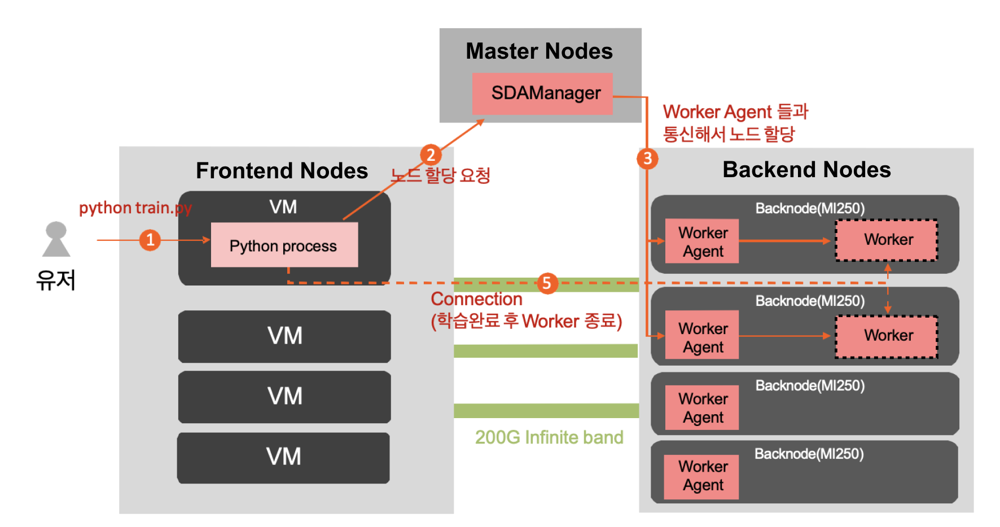
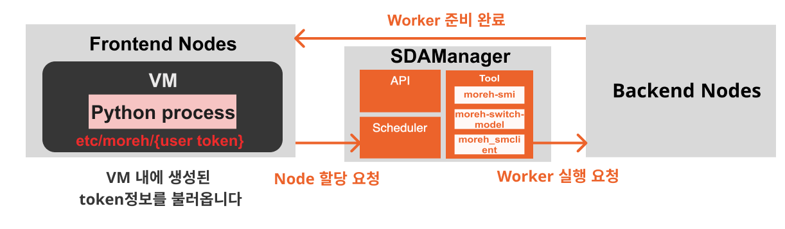
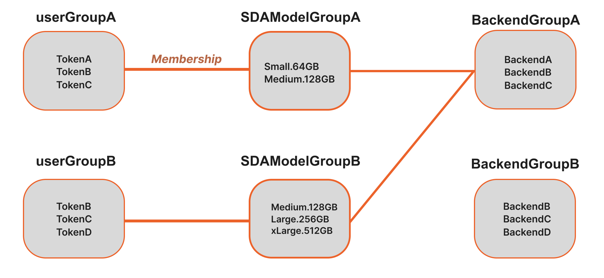

MCP Documentation
===========================

MCP 이해하기
~~~~~~~~~~~~~~~~~~~~~~~~~~~~~~~~~~~~~~~~~~~~~~~~

**기존 서버 실행 방식 VS Moreh Cloud 가상 시스템**

▪ **기존 GPU 서버 실행 방법**: 일반 GPU가 장착된 기존 서버를 사용하게 되면 카탈로그에서 특정 물리적 서버 1개 만을 선택해서 사용합니다. 또한 GPU 서버를 구매하고 유지보수하는 비용이 매우 높습니다. 기존 GPU 서버에서는 할당된 GPU 자원 내에서만 AI 어플리케이션을 수행할 수 있기에 적은 자원을 사용하는 경우 비용 대비 효율이 떨어질 수밖에 없습니다. 또한 여러 사용자가 공유하는 GPU 서버에서는 개별 사용자가 필요한 GPU 자원을 정확하게 할당하는 것이 어렵습니다. 

▪ **GPU 가상화 방법**: Moreh Cloud Platform은 가상화된 GPU가 scalable 한 상태로 제공합니다. 연산 실행 시에만 GPU 자원을 할당하여 합리적인 비용으로 AI 애플리케이션이 GPU 연산 자원을 효율적으로 사용할 수 있습니다. 또한 가상화된 GPU를 사용하면 물리 서버에서 리소스를 보다 효율적으로 활용할 수 있으며, GPU 자원 규모를 실시간으로 탄력적으로 변경하고 쉽게 애플리케이션을 추가 및 업데이트할 수 있어 더 나은 확장성을 제공합니다.

- [Frontend Nodes] **VM(Virtual Machine)**: 사용자에게 제공되는 가상 머신(VM)입니다.
- [Master Nodes] **SDAManager**: AI 가속기를 할당하고 GPU 리소스를 관리합니다.
    - 프론트 노드의 VM에서 노드 할당 요청을 받으면 백엔드 노드에서 가속기(KT AI Accelerator)를 할당합니다.
    - Scheduler: 우선순위와 등록 시간에 따라 작업(job)이 정렬되며 사용 가능한 GPU가 없을 경우 스케쥴러에서 대기합니다.
         - job 생성 시 GPU를 예약합니다.
         - job 삭제 시 GPU 반납합니다.
- [Backend Nodes] **Worker**: Frontend VM에서 노드 할당 요청이 들어오면 Worker Agent에 의해서 Worker가 실행됩니다.

Moreh Cloud Components
~~~~~~~~~~~~~~~~~~~~~~~~~~~~~~~~~~~~~~~~~~~~~~~

MCP의 구성요소 살펴보기
--------------------
- **Token**: 사용자를 식별하기 위한 hash value이며 사용자마다 고유값으로 부여됩니다. 이 Token 은 Moreh Cloud Platform 을 사용하기 위해 사용자가 필수적으로 소유하고 있어야 하며, 기본적으로 양도해서도 안됩니다. Token은 일반적으로 **사용자의 VM 안에 위치하며, Moreh Cloud Platform 은 이 Token 값을 바탕으로 사용자를 식별하고 학습이 실행되게 되므로, 이 Token 값이 없으면 GPU 연산 및 Pytorch가 실행되지 않습니다.**
- **SDA(Software-Defined Accelerator)**:  엔드유저가 사용하는 GPU의 단위이며 하나의 Token에 종속됩니다.
- **SDA Manager API** : ``moreh_smclient`` 를 통해서 정보 변경 등의 작업을 합니다.
- **Scheduler** - Queue에 등록된 priority를 기반으로 Job에 대한 Device를 할당합니다. 사용자가 GPU 사용을 요청할 때 **Scheduler에 의해 동적으로 GPU를 할당하게 되며** SDA 생성 시 GPU를 선점하고 SDA 삭제 시 GPU 반납합니다.
- **Tool** : 엔드유저가 모델 학습 시 사용하는 명령어 및 옵션입니다.
    - ``moreh-smi``: 실행 중인 Token/SDA 정보 조회 가능, 전체 메모리 용량과 현재 사용 중인 메모리 확인
    - ``moreh-switch-model``: SDA를 변경하여 VM에서 사용할 GPU 자원의 양을 조정가능
    - ``moreh_smclient``:  SDAManager API를 호출하는 관리자 tool이면서 worker에 대해서 버전 확인, 토큰 설정 등의 관리를 위한 API
- **Worker** : frontend에서 요청이 들어왔을 때 Backend Nodes에서 실행됩니다.

**Moreh Cloud 서비스 특장점 (What SDA Manager Module provides)**
------------------------------------------------------------------------

MCP는 다음과 같은 추가적인 혜택을 제공합니다.

1. **GPU 자원 동적 할당**
    1. AI 가속기를 변경하여 고객이 사용하는 VM의 GPU 자원의 양을 조정할 수 있습니다. AI 가속기가 프로그램을 실행할 때, 별도의 자원 팜에 있는 GPU 자원이 VM에 동적으로 할당되며, 프로그램이 종료되면 GPU 자원이 자동으로 해제됩니다. 따라서 사용자의 GPU 자원 점유율과 시간에 비례하여 요금이 부과됩니다.
2. **Python 코드 수정 없이 실행하여 개발의 연속성 보장** 
    1. 병렬 처리를 위해 코드에 DP, DDP 등을 적용하는 것은 일부 사용자에게 복잡성을 야기합니다. HAC 서비스는 코드에서 병렬 처리를 구현하지 않고도 원하는 AI 가속기 규모에 따라 대규모 GPU 클러스터에서 자동으로 병렬 처리를 활성화합니다. 따라서 Moreh 솔루션에서는 DP와 DDP와 같은 병렬 처리 코드를 구현할 필요가 없습니다.
    2. PyTorch와 TensorFlow를 포함한 표준 딥러닝 프레임워크와 완벽하게 호환되므로 사용자는 코드 수정 없이 중요한 AI 문제 해결에 집중할 수 있습니다.

Moreh Cloud API Information
~~~~~~~~~~~~~~~~~~~~~~~~~~~~~~~~~~~~~~~

`Moreh Cloud API <https://dev-console.moreh.dev/api-docs/>`_ 를 사용해서 엔드유저에 대한 접속 Token 및 SDA을 관리(생성/변경/삭제)할 수 있습니다.

`Moreh API document <https://docs.moreh.io/ko/latest/HAC/8_api.html>`_ 는 SDA Manager를 관리하기 위한 모든 API 목록 및 구현 방법을 소개합니다.

- Moreh Cloud API Information
    - `User <https://docs.moreh.io/ko/latest/HAC/8_api.html#user>`_
    - `Check <https://docs.moreh.io/ko/latest/HAC/8_api.html#check>`_
    - `Hardware <https://docs.moreh.io/ko/latest/HAC/8_api.html#hardware>`_
    - `Backend <https://docs.moreh.io/ko/latest/HAC/8_api.html#backend>`_
    - `SDAModel <https://docs.moreh.io/ko/latest/HAC/8_api.html#sdamodel>`_
    - `SDA <https://docs.moreh.io/ko/latest/HAC/8_api.html#sda>`_
    - `Token <https://docs.moreh.io/ko/latest/HAC/8_api.html#token>`_
    - `Scheduler <https://docs.moreh.io/ko/latest/HAC/8_api.html#scheduler>`_
    - `Membership <https://docs.moreh.io/ko/latest/HAC/8_api.html#membership>`_
    - `Usage <https://docs.moreh.io/ko/latest/HAC/8_api.html#usage>`_
    - `Log <https://docs.moreh.io/ko/latest/HAC/8_api.html#log>`_

User
-------

Sign in 관련 사용자 정보를 다룹니다.

- ``GET /api/user`` - 사용자 목록을 불러옵니다.
- ``POST /api/user`` - 사용자 정보를 저장합니다.
- ``PUT /api/user`` - 사용자 패스워드를 재설정합니다.
- ``GET /api/user/signin`` - Sign in 여부를 확인합니다.
- ``GET /api/user/qna`` - 패스워드 재설정을 위한 QnA를 확인합니다.

Check
----------

API 와 DB 상태 및 gRPC 서버와 클라이언트의 통신 상태가 정상적인지 확인합니다. 

- ``GET /api/check`` - API, IPMI, DB, gRPC 상태 체크. API가 에러일 경우 모두 에러로 표시됨.

Hardware
----------

사용자 툴(`moreh-smi`)에서 넘어오는 backend 정보(SDA 및 token, 학습 process 정보)들을 불러옵니다.

- ``GET /api/signal`` - moreh-smi 가 설치된 노드들의 정보를 불러옵니다.

Backend
---------------

사용자 툴(`moreh-smi`)에서 넘어오는 backend 정보(SDA 및 token, 학습 process 정보)들을 관리합니다.

- ``GET /api/backend`` - Backend 정보를 모두 불러옵니다.
- ``POST /api/backend`` - Backend 정보를 생성합니다.
- ``PUT /api/backend`` - Backend 정보를 수정하거나 전원 원격 제어를 위해 IPMI 명령어를 실행합니다.
- ``DELETE /api/backend`` - Backend 정보를 삭제합니다.
- ``GET /api/backend/group`` - Backend의 group 정보를 불러옵니다.
- ``POST /api/backend/group`` - Backend group 정보를 생성합니다.
- ``PUT /api/backend/group`` - Backend group 정보를 수정합니다.
- ``DELETE /api/backend/group`` - Backend group 정보를 삭제합니다.
- ``PUT /api/backend/device/status`` - Backend ID를 지정하여 Device들의 Status를 변경합니다.
- ``POST /api/backend/grouping`` - Backend ID를 지정하여 Device들의 Status를 변경합니다.
- ``PUT /api/backend/grouping`` - Backend로 이루어진 Group들 간에 관계를 수정합니다.
- ``DELETE /api/backend/grouping`` - Backend의 Grouping 된 것을 해제합니다.

SDAModel
---------------

사용 가능한 AI 가속기 디바이스(SDAModel)를 관리합니다.

- ``GET /api/sdamanager/sdamodel`` - SDA Model 목록(micro, Small, Large, xLarge 등)을 불러옵니다
- ``POST /api/sdamanager/sdamodel`` - SDA Model 을 추가합니다.
- ``DELETE /api/sdamanager/sdamodel`` - SDA Model을 삭제합니다.
- ``POST /api/sdamanager/sdamodel/grouping`` - SDA Model의 Grouping을 생성합니다.
- ``DELETE /api/sdamanager/sdamodel/grouping`` - SDA Model의 Grouping을 해제합니다.
- ``GET /api/sdamanager/sdamodel/group`` - SDA Model 그룹 정보를 불러옵니다.
- ``POST /api/sdamanager/sdamodel/group`` - SDA Model 그룹 정보를 생성합니다.
- ``PUT /api/sdamanager/sdamodel/group`` - SDA Model 그룹 정보를 수정합니다.
- ``DELETE /api/sdamanager/sdamodel/group`` - SDA Model 그룹 정보를 수정합니다.

SDA
---------------

Token 별 사용 가능한 AI 가속기 디바이스(SDA)를 관리합니다.

- ``GET /api/sdamanager/sda`` - SDA 정보를 모두 불러옵니다. 할당된 SDA가 존재한다면 할당된 device와 backend 또한 출력합니다.
- ``POST /api/sdamanager/sda`` - SDA Model, Token, 고정할당유무, 별칭을 지정하면 SDA를 생성합니다.
- ``PUT /api/sdamanager/sda`` - Token 값을 지정하고 SDA Model ID를 선택하면 Token의 SDA Model이 지정된 값으로 수정합니다.
- ``DELETE /api/sdamanager/sda`` - Token 값을 지정하면 해당 SDA를 삭제합니다.
- ``GET /api/sdamanager/sdautilizations`` - SDA의 할당 정보(메모리 사용량, 프로세스 정보)를 불러옵니다.

Token
---------------

Token 및 Group 정보를 관리합니다.

- ``GET /api/sdamanager/token`` - Token 정보를 모두 불러옵니다.
- ``POST /api/sdamanager/token`` - Token 별칭을 입력하면 고유한 값을 가진 Token을 생성합니다.
- ``PUT /api/sdamanager/token`` - Token이 가지고 있는 고유한 값을 입력하면 Token을 수정합니다.
- ``DELETE /api/sdamanager/token`` - Token이 가지고 있는 고유한 값을 입력하면 Token을 삭제합니다.
- ``POST /api/sdamanager/token/grouping`` - Token (user) Grouping을 생성합니다.
- ``DELETE /api/sdamanager/token/grouping`` - Token (user) Grouping을 해제합니다.
- ``GET /api/sdamanager/token/group`` - Token (user) 그룹 정보를 불러옵니다.
- ``POST /api/sdamanager/token/group`` - Token (user) 그룹 정보를 생성합니다.
- ``PUT /api/sdamanager/token/group`` - Token (user) 그룹 정보를 수정합니다.
- ``DELETE /api/sdamanager/token/group`` - Token (user) 그룹 정보를 삭제합니다.

Scheduler
---------------

GPU 스케줄러의 대기상태(queue)와 할당 기록을 확인합니다.

- ``GET /api/scheduler/queue`` - GPU 스케줄러의 큐(queue) 안의 정보를 불러옵니다.
- ``PUT /api/scheduler/queue`` - 큐에서 대기중인 GPU 작업의 순서를 바꿀 때 사용합니다.
- ``DELETE /api/scheduler/queue`` - 등록된 Job을 삭제합니다.
- ``GET /api/scheduler/history`` - GPU 스케줄러의 기록 정보를 불러옵니다.

Membership
---------------

- ``GET /api/membership`` - Membership 정보를 불러옵니다.
- ``POST /api/membership`` - Membership 정보를 생성합니다. (Group ID와 Group ID간의 연결을 생성합니다.
- ``DELETE /api/membership`` - Membership 정보를 삭제합니다. (Group ID와 Group ID간의 연결을 삭제합니다)

Usage
---------------

GPU 사용 기록을 확인합니다.

- ``GET /api/usage`` - GPU 사용 기록을 불러옵니다.

Log
---------------

API Log를 관리합니다.

- ``GET /api/log/sdamanager/event`` - SDAManager에 발생한 Event(SDA 생성, SDA 변경 등)를 불러옵니다.

Group 개념
~~~~~~~~~~~~~~~~~~

모레 솔루션을 이용하는 고객들에게는 사용자 자신을 식별하기 위해 암호화된 token을 받게 됩니다. 이 token은 "``etc/moreh/{토큰값}``" 형식으로 가상 머신(VM) 내에 저장됩니다. 각 고객의 VM은 해당 토큰을 사용하여 마스터로 GPU 리소스를 요청하게 됩니다. Moreh Cloud Platform은 토큰을 기반으로 동작하는 클라우드 시스템이므로, 토큰이 없으면 GPU 연산 및 PyTorch 실행이 제한됩니다. 

그룹 기능은 고객의 토큰에 따라 사용할 수 있는 AI 가속기 디바이스와 그 수를 제어하는 기능입니다. 예를 들어, A 고객은 Small과 Medium만 사용하도록 설정된 SDAModelGroupA에 연결됩니다. B 고객은 Medium부터 Large와 xLarge까지 옵션을 선택할 수 있도록 제한을 설정됩니다. 이렇게 그룹 기능을 통해  유연하게 GPU 자원을 조절할 수 있게 됩니다. KT Cloud 관리자분들께서는 Group기능으로 고객들의 GPU 자원 관리를 보다 원활하게 수행하실 수 있습니다.

예를들어 위와 같이 Group 관계가 형성된 경우 UserGroupA의 Token이 할당된 고객은 Small과 Medium 디바이스만을 사용 가능하며 Large와 xLarge는 사용이 불가능합니다.

마찬가지로 UserGroupB의 TokenB, TokenC, TokenD가 할당된 고객은 Medium, Large, xLarge만을 사용 가능하고 Small 디바이스는 사용이 불가능합니다.

Group 구성
--------------------

사용자의 Token, SDA Model, Backend가 각각 group으로 존재하며 Membership이 User Group과 SDAModel 간에 관계를 형성합니다.

- `User Group <https://docs.moreh.io/ko/latest/HAC/9_MCP%20manual.html#id2/>`_ 
- `SDAModel Group <https://docs.moreh.io/ko/latest/HAC/9_MCP%20manual.html#id3/>`_ 
- `Backend Group <https://docs.moreh.io/ko/latest/HAC/9_MCP%20manual.html#id4/>`_ 

1. User Group
--------------------

SDAManager에서의 사용자 token으로 이루어진 그룹

- 하나의 token이 여러 user group에 포함될 수 있습니다.
- `moreh_smclient` 명령어 : 자세한 파라미터는 smclient에서 확인
    - smclient에서 각 명령어 뒤에 “?” 를 입력하면 상세한 설명을 확인 가능합니다.
        - ``create usergroup`` : user group 생성, 뒤에 list로 token들을 넣을 수 있음
        - ``delete usergroup`` : user group 삭제
        - ``update usergroup name`` : user group의 이름 변경
        - ``update usergroup list`` : user group의 token들을 list의 token들로 변경
        - ``show usergroup`` : user group과 들어있는 token들을 보여줌
        - ``add usergroup``: user group에 특정 token 추가
        - ``remove usergroup`` : user group에 특정 token 제거

.. code-block:: shell

    > show usergroup
    +----------------------------------------------------------------------+
    |  ID  |  Name  |                        Childs                        |
    +======================================================================+
    |   1  |  ug1   |  dGFlczE2NzY2MDAwNDAzMTk=, dGVzdDE2NzcwNDM5NjkxOTg=  |
    |   2  |  ug2   |                                                      |
    +----------------------------------------------------------------------+

2. SDAModel Group
--------------------

SDAModel들로 이루어진 그룹입니다.

- 하나의 token이 여러 sda model group에 접근할 수 있습니다.
- user group의 token들이 쓸 수 있는 sda model을 제한합니다.
    - 여러 user group과 관계될 수 있음
- 하나의 backend group과 관계되어 해당 sda model group에 속해있는 sda model을 사용해 sda를 만들면 그 sda는 해당하는 backend group안의 backend들만 사용
- moreh-switch-model로 봤을때 어떤 그룹에 해당하는 sda model인지 확인가능
- moreh_smclient 명령어 : 자세한 파라미터는 smclient에서 확인
    - smclient에서 각 명령어 뒤에 “?” 를 입력하면 상세한 설명을 확인 가능합니다.
        - ``create sdamodelgroup`` : sdamodel group 생성, 뒤에 list로 model들을 넣을 수 있음
        - ``delete sdamodelgroup`` : sdamodel group 삭제
        - ``update sdamodelgroup name`` : sdamodel group의 이름 변경
        - ``update sdamodelgroup backendgroup`` : sdamodel group의 backend group을 변경
        - ``update sdamodelgroup list`` : sdamodel group의 model들을 list의 model들로 변경
        - ``show sdamodelgroup`` : sdamodel group과 들어있는 model들을 보여줌
        - ``add sdamodelgroup`` : sdamodel group에 특정 model 추가
        - ``remove sdamodelgroup`` : sdamodel group에 특정 model 제거

.. code-block:: shell

    > show sdamodelgroup
    +--------------------------------------------------------------------+
    |  ID  |  Name  |        Backend Group       |        Childs         |
    +====================================================================+
    |   1  |  mg1   |  default_backend_group(0)  |  micro, small, large  |
    |   2  |  mg2   |  bg1(1)                    |                       |
    +--------------------------------------------------------------------+

    $ moreh-switch-model
    Current Moreh SDA: small at mg1

    1. micro mg1
    2. small mg1 *
    3. large mg1

    Selection (1-3, q, Q):

3. Backend Group
--------------------

backend들로 이루어진 그룹입니다.

- 하나의 backend는 하나의 그룹에만 들어갈 수 있습니다.
- 기본 그룹[id : 0]이 있어서 처음에는 다 기본그룹에만 들어가 있습니다.
- sda model group과 관계되며 sda 들이 쓸 수 있는 backend를 제한합니다
    - 여러 sdamodel group과 관계 될 수 있습니다.
    - 따라서 위 예시 그림에 Small, Medium, Large, xLarge가 점유할수있는 Backend 리소스는 BackendA, BackendB, BackendC로 제한됩니다. (D는 해당이 안됩니다)
- moreh_smclient 명령어 : 자세한 파라미터는 smclient에서 확인
    - smclient에서 각 명령어 뒤에 “?” 를 입력하면 상세한 설명을 확인 가능합니다.
        - ``create backendgroup`` : backend group 생성, 뒤에 list로 backend들을 넣을 수 있음
        - ``delete backendgroup`` : backend group 삭제
        - ``update backendgroup name`` : backend group의 이름 변경
        - ``update backendgroup list`` : backend group의 backend들을 list의 backend들로 변경
          - list의 backend들이 기본이나 해당 backend group에 들어있어야만 함
        - ``show backendgroup`` : backend group과 들어있는 backend들을 보여줌
        - ``add backendgroup`` : backend group에 특정 backend 추가
        - ``remove backendgroup`` : backend group에 특정 backend 제거
        - ``update backend group`` : 특정 backend의 group을 변경

.. code-block:: shell

    > show backendgroup
    +---------------------------------------------+
    |  ID  |          Name           |   Childs   |
    +=============================================+
    |   0  |  default_backend_group  |  rx6900-7  |
    |   1  |  bg1                    |            |
    +---------------------------------------------+

4. Membership
--------------------

user group과 sdamodel group간의 관계를 형성합니다.

- N:M관계이므로 어느 한쪽에 종속될 수 없습니다.
- moreh_smclient 명령어 : 자세한 파라미터는 smclient에서 확인
    - smclient에서 각 명령어 뒤에 “?” 를 입력하면 상세한 설명을 확인 가능합니다.
        - ``show membership`` : user group과 관계된 sda model group들을 보여줌
        - ``add membership`` : user group과 sda model group과의 관계를 만듬
        - ``remove memebership`` : user group과 sda model group과의 관계를 없앰

.. code-block:: shell

  > show membership
  +----------------------------+
  |  ID  |  Name  |   Childs   |
  +============================+
  |   1  |  ug1   |  mg1, mg2  |
  |   2  |  ug2   |  mg1, mg2  |
  +----------------------------+
  > add membership 1 1      # 1은 UserGroupA의 id & 1은 SDAModelGroupA의 id
  Add Membership between User Group and SDAModel group success.
  > remove membership 1 1   # 1은 UserGroupA의 id & 1은 SDAModelGroupA의 id
  Remove Membership between User Group and SDAModel group success.

5. Relation
--------------------

user group부터 시작되는 모든 group들간의 전체적인 관계를 보여줍니다.

- moreh_smclient 명령어 : 자세한 파라미터는 smclient에서 확인
    - smclient에서 각 명령어 뒤에 “?” 를 입력하면 상세한 설명을 확인 가능합니다.
        - ``show relationship`` : user group과 관계된 sda model group 그리고 그 sda model group이 사용할 backend group을 보여줌

.. code-block:: shell

    > show relationship
    +----------------------------------------------------------------------+
    |  User Group(id)  |  SDAModel Group(id)  |      Backend Group(id)     |
    +======================================================================+
    |  ug1(1)          |  mg1(1)              |  default_backend_group(0)  |
    |                  |  mg2(2)              |  bg1(1)                    |
    |  ug2(2)          |  mg1(1)              |  default_backend_group(0)  |
    |                  |  mg2(2)              |  bg1(1)                    |
    +----------------------------------------------------------------------+

Moreh SMClient 사용하기
~~~~~~~~~~~~~~~~~~~~~~~~~

**moreh_smclient** 는 HAC 환경에서 backnode에 실행되는 worker에 대해서 버전 확인, 토큰 설정 등의 관리툴입니다.

1. `moreh_smclient 접속 <https://dev-console.moreh.dev/api-docs/>`_ 
2. `Token 생성 <https://docs.moreh.io/ko/latest/HAC/8_api.html/>`_ 
3. `Token 조회/변경 및 취소 <https://docs.moreh.io/ko/latest/HAC/8_api.html/>`_ 
4. `Token SDA 모델 변경 <https://dev-console.moreh.dev/api-docs/>`_ 
5. `Token 삭제 <https://docs.moreh.io/ko/latest/HAC/8_api.html/>`_ 
6. `기타 명령어 <https://docs.moreh.io/ko/latest/HAC/8_api.html/>`_ 

1. moreh_smclient 접속하기
----------------------------

SDAManager 의 클라이언트인 moreh_smclient 는 다음과 같이 실행할 수 있습니다. 현재 SDAManager 의 상태나 정보를 체크할 때 사용하게 됩니다. moreh_smclient를 실행하려면 SDAManager에 연결할 수 있도록 ip, port의 환경설정이 필요합니다.

.. code-block:: shell

  #master node 에서 root 개념으로 접속
  kubectl exec -it -n maf deploy/sdamanager-api-deployment 
  -- /app/bin/moreh_smclient 

2. Token 생성하기
----------------------------

기본적인 Token 생성(발급) 및 삭제 방법은 moreh-smclient에서 명령어 ``help`` 를 입력하면 다음과 같이 출력됩니다.

.. code-block:: shell

    (moreh) user@rx6900-6:~/moreh/framework/logs$ moreh_smclient SDAManager's Client. Connect to 127.0.0.1:30105
    Moreh Corporation Copyright (c) 2020-. All rights reserved.

    >help
    create sda             : Create new SDA or add SDA to registered Token
                          (usages: create sda {Token} {SDAModelID} {description})

    create token           : Create new Token
                          (usages: create token {description} {priority : optional})

    delete sda             : Delete all SDAs using requested Token or delete specified SDA using Token, SDA's ID
                          (usages: delete sda {Token} {SDA's ID : optional})

    delete token            : Delete Token
                            (usages: delete token {Token})

create token 이라는 명렁어로 token을 생성할 수 있는데 이때 {description} 으로 되어 있는 부분이 token name 입니다.

**Token 생성 및 SDA 설정 예시**

남청주 HAC 기준 Token 기본 생성 명령어

Token을 먼저 생성하고 반환 받은 token으로 SDA를 생성합니다. SDA를 생성할 때는 model 값을 함께 주어야 합니다. SDA 생성시 넣는 숫자는 model의 id입니다.

.. code-block:: shell

    [root@Master01-4B0806u18cj1-hacgpu ~]$ moreh_smclient
    SDAManager's Client. Connect to 192.168.64.103:50052
    Moreh Corporation Copyright (c) 2020-. All rights reserved.

    >create token user@gmail.com_moreh-test-for-doc
    Create SDA Success (Token : YmFidTE2NjcyOTE2NTI0MjU=)

    >create sda YmFidTE2NjcyOTE2NTI0MjU= 1 sda_name
    Create SDA success.

    >get sda YmFidTE2NjcyOTE2NTI0MjU=
    +---------------------------------------------------------------------------------------+
    |   ID   |            Token           |  SDAModel  |  Reserved  |  Be_ID  |  Device_ID  |
    +=======================================================================================+
    |  1542  |  YmFidTE2NjcyOTE2NTI0MjU=  |  1         |  False     |         |             |
    +---------------------------------------------------------------------------------------+

sdamodel 의 ID는 show sdamodel 이라는 명령어로 확인할 수 있습니다.

.. code-block:: shell

    >show sdamodel
    +---------------------------------------+
    |  ID  |        Name        |  Devices  |
    +=======================================+
    |   1  |  Small.64GB        |        1  |
    |   2  |  Medium.128GB      |        2  |
    |   3  |  Large.256GB       |        4  |
    |   4  |  xLarge.512GB      |        8  |
    |   5  |  2xLarge.1024GB    |       16  |
    |   6  |  3xLarge.1536GB    |       24  |
    |   7  |  4xLarge.2048GB    |       32  |
    |   8  |  6xLarge.3072GB    |       48  |
    |   9  |  8xLarge.4096GB    |       64  |
    |  10  |  12xLarge.6144GB   |       96  |
    |  11  |  24xLarge.12288GB  |      192  |
    |  12  |  48xLarge.24576GB  |      384  |
    |  52  |  1.5xLarge.768GB   |       12  |
    +---------------------------------------+

**한줄 명령 예제**

.. code-block:: shell

  모든 명령어는 한줄 명령으로 실행 가능합니다.

  $ moreh_smclient --command 'create token babukk89@gmail.com_moreh-test-for-doc'
  Create SDA Success (Token : YmFidTE2NjcyOTM1NTkxMDg=)

  $ moreh_smclient --command 'create sda YmFidTE2NjcyOTM1NTkxMDg= 1 sda_name'
  Create SDA success.

  $ moreh_smclient --command 'get sda YmFidTE2NjcyOTM1NTkxMDg='
  +---------------------------------------------------------------------------------------+
  |   ID   |            Token           |  SDAModel  |  Reserved  |  Be_ID  |  Device_ID  |
  +=======================================================================================+
  |  1543  |  YmFidTE2NjcyOTM1NTkxMDg=  |  1         |  False     |         |             |
  +---------------------------------------------------------------------------------------+

.. code-block:: shell

    >show token
    +---------------------------------------------------------------------------------------------------------------------------------------------------------------------------------------------------------+
    |            Token           |                    Description                    |  Cur SDA  |  Max SDA  |  Priority  |  Access Level  |                             ENV value                            |
    +=========================================================================================================================================================================================================+
    |  c2VoZTE2NTA2MjQ3MTQzNjA=  |  usertest1                                        |  1        |  1        |  1         |  USER          |                                                                  |
    |  c2VoZTE2NTEyMDA5ODc3NzA=  |  usertest2                                        |  2209     |  1        |  1         |  USER          |                                                                  |
    |  a3R1YzE2NTE2NTA1NjIyOTU=  |  user@gmail.com_testMOREH                         |  7        |  1        |  0         |  USER          |                                                                  |
    |  aGFjLTE2NTIyNjg3MDMyNTc=  |  hac-worker01                                     |  13       |  1        |  0         |  USER          |                                                                  |
    |  aGFjLTE2NTIyNjg3MDQyODg=  |  hac-worker02                                     |  16       |  1        |  0         |  USER          |                                                                  |
    |  aGFjLTE2NTIyNjg3MDUwNTQ=  |  hac-worker03                                     |  19       |  1        |  0         |  USER          |                                                                  |
    |  bW9yZTE2NTI4MzY0ODM3Mzk=  |  moreh-server-0                                   |  139      |  1        |  0         |  USER          |                                                                  |
    |  bW9yZTE2NTI4MzY0ODM3NTU=  |  moreh-server-1                                   |  142      |  1        |  0         |  USER          |                                                                  |
    |     ...                    |                                                   |           |           |            |                |                                                                  |
    |  bW9yZTE2NTI4MzY0ODQwMDg=  |  moreh-server-19                                  |  196      |  1        |  0         |  USER          |                                                                  |
    |  a3QuZDE2ODQyMTk1OTc1MjI=  |  kt.datalake@gmail.com_vpn-hac05                  |  4441     |  1        |  0         |  USER          |                                                                  |
    +---------------------------------------------------------------------------------------------------------------------------------------------------------------------------------------------------------+

2-1. 전체 노드 및 디바이스 사용 현황 조회
--------------------------------------------------------

``show backend`` 명령어를 사용하여 moreh_smclient로 해당 클러스터에서 사용되는 노드와 디바이스 정보를 조회할 수 있습니다.

출력되는 조회 정보는 다음과 같습니다.
- Name : 노드의 이름
- IP : 노드의 ip address
- Status : 노드의 상태 정보
    - SHUTDOWN : 노드 사용 불가
    - ACTIVE : 노드 사용 가능
- Device : 디바이스의 갯수와 상태 정보
    - SHUTDOWN : 디바이스 사용 불가한 상태
    - IDLE : 디바이스 사용 가능
    - PREPARING : 할당 된 디바이스 사용 준비
    - PROCESSING : 디바이스 사용
    - CLEANING : 사용된 디바이스 정리

**사용 예시**

.. code-block:: shell

    >show backend
    +-----------------------------------------------------------------------------------------------------+
    |  ID  |   Name   |        Ip        |  Group  |   Status   |       Device       |       Device       |
    +=====================================================================================================+
    |  1   |  back01  |  192.168.110.0   |         |  ACTIVE    |  0  |  PROCESSING  |  1  |  PROCESSING  |
    |      |          |                  |         |            |  2  |  PROCESSING  |  3  |  PROCESSING  |
    |      |          |                  |         |            |  4  |  PROCESSING  |  5  |  PROCESSING  |
    |      |          |                  |         |            |  6  |  PROCESSING  |  7  |  PROCESSING  |
    |  2   |  back02  |  192.168.110.1   |         |  ACTIVE    |  0  |  PROCESSING  |  1  |  PROCESSING  |
    |      |          |                  |         |            |  2  |  PROCESSING  |  3  |  PROCESSING  |
    |      |          |                  |         |            |  4  |  PROCESSING  |  5  |  PROCESSING  |
    |      |          |                  |         |            |  6  |  PROCESSING  |  7  |  PROCESSING  |
    |  3   |  back03  |  192.168.110.2   |         |  ACTIVE    |  0  |  PROCESSING  |  1  |  PROCESSING  |
    |      |          |                  |         |            |  2  |  PROCESSING  |  3  |  PROCESSING  |
    |      |          |                  |         |            |  4  |  PROCESSING  |  5  |  PROCESSING  |
    |      |          |                  |         |            |  6  |  PROCESSING  |  7  |  PROCESSING  |
    |  ... |          |                  |         |            |     |              |     |              | 
    |  ... |          |                  |         |            |     |              |     |              | 
    |  ... |          |                  |         |            |     |              |     |              | 
    |  57  |  back57  |  192.168.110.56  |         |  ACTIVE    |  0  |  IDLE        |  1  |  IDLE        |
    |      |          |                  |         |            |  2  |  IDLE        |  3  |  IDLE        |
    |      |          |                  |         |            |  4  |  IDLE        |  5  |  IDLE        |
    |      |          |                  |         |            |  6  |  IDLE        |  7  |  IDLE        |
    |  58  |  back58  |  192.168.110.57  |         |  ACTIVE    |  0  |  IDLE        |  1  |  IDLE        |
    |      |          |                  |         |            |  2  |  IDLE        |  3  |  IDLE        |
    |      |          |                  |         |            |  4  |  IDLE        |  5  |  IDLE        |
    |      |          |                  |         |            |  6  |  IDLE        |  7  |  IDLE        |
    |  59  |  back59  |  192.168.110.58  |         |  ACTIVE    |  0  |  IDLE        |  1  |  IDLE        |
    |      |          |                  |         |            |  2  |  IDLE        |  3  |  IDLE        |
    |      |          |                  |         |            |  4  |  IDLE        |  5  |  IDLE        |
    |      |          |                  |         |            |  6  |  IDLE        |  7  |  IDLE        |
    |  60  |  back60  |  192.168.110.59  |         |  ACTIVE    |  0  |  IDLE        |  1  |  IDLE        |
    |      |          |                  |         |            |  2  |  IDLE        |  3  |  IDLE        |
    |      |          |                  |         |            |  4  |  IDLE        |  5  |  IDLE        |
    |      |          |                  |         |            |  6  |  IDLE        |  7  |  IDLE        |
    +-----------------------------------------------------------------------------------------------------+

2-2. 현재 실행 또는 대기 중인 작업 조회
-------------------------------------

``show job`` 명령어를 실행하여 moreh_smclient로 실행 중 또는 대기중인 작업 정보를 조회할 수 있습니다.

출력되는 조회 정보는 다음과 같습니다.

- FeID : Job의 id
- Token: 실행한 Token
- PRY : Job의 우선순위 값 (기본값 : 0)
- Status : Job의 상태정보
    - QUEUED : GPU 자원량이 부족해 할당받지 못해 대기중인 상태
    - SUMMITED : GPU 자원을 할당받아 작업 준비 상태
    - RUNNING : 작업중
- PID : 해당 vm에서의 pid
- ProcessName : 실행한 process 및 매개변수 정보

**사용 예시**

.. code-block:: shell

    >show job
    +----------------------------------------------------------------------------------------------------------------------------------------------------------------------------------------------------------------------------------------------------------------------------------------------------------------------------------------------------------------------------------------------------------------------------------------------------------------------------------------+
    |  FeID   |            Token           |  PRY  |  Status   |   PID   |                                                                                                                                                                                      Process Name                                                                                                                                                                                      |        Start Time        |
    +========================================================================================================================================================================================================================================================================================================================================================================================================================================================================================+
    |  24622  |  YmFidTE2NjA3ODU5NDE1Mjc=  |    0  |  RUNNING  |   9330  |  python train.py --dataset inat --load-checkpoint ./checkpoint/162 --save-model model.pt                                                                                                                                                                                                                                                                                               |  2022-09-14 23:14:10.14  |
    |  26197  |  YmFidTE2NjE5OTMxMTU5MTQ=  |    0  |  RUNNING  |   4109  |  python main_train_pmlffnet_v1_sat_ms_comp_pan_comp.py                                                                                                                                                                                                                                                                                                                                 |  2022-09-15 21:53:19.07  |
    |  26428  |  YmFidTE2NjIwODIwNTM2Njg=  |    0  |  RUNNING  |  20906  |  python train.py --model-cfg ./models/yolov5x6.yaml --save-model model.pt -b 128 -e 300 --img 1280 --num-workers 6                                                                                                                                                                                                                                                                     |  2022-09-16 01:39:56.34  |
    |  27541  |  YmFidTE2NjE5MzI2MjM3NzQ=  |    0  |  RUNNING  |  16874  |  python train_imagenet.py                                                                                                                                                                                                                                                                                                                                                              |  2022-09-19 09:54:49.83  |
    |  27772  |  YmFidTE2NjA3Mjc1Njg1MDc=  |    0  |  RUNNING  |  27034  |  python train_tudl_non_ddp.py --cls=dragon                                                                                                                                                                                                                                                                                                                                             |  2022-09-19 16:32:53.13  |
    |  27823  |  YmFidTE2NjMxMzgyMDAzMDU=  |    0  |  RUNNING  |  24802  |  python train.py --workers 8 --device 0 --batch-size 256 --data data/coco.yaml --img 640 640 --cfg cfg/training/yolov7.yaml --weights  --name yolov7 --hyp data/hyp.scratch.p5.yaml                                                                                                                                                                                                    |  2022-09-19 17:50:33.25  |
    |  27910  |  YmFidTE2NjMwNTE2NTgyMTc=  |    0  |  RUNNING  |  11775  |  python train.py --save-model model.pt -b 64 -e 100                                                                                                                                                                                                                                                                                                                                    |  2022-09-20 10:19:57.81  |
    |  27913  |  YmFidTE2NTgyODAzNzE1NDk=  |    0  |  RUNNING  |  31688  |  python train.py -b 128 --num-workers 4                                                                                                                                                                                                                                                                                                                                                |  2022-09-20 10:49:12.78  |
    |  27991  |  YmFidTE2NjE4NDgxMzAzMzE=  |    0  |  RUNNING  |  28849  |  python ./reference/train.py --save-model /mnt/addvol/workspace/gpt/model/first_model.pt -b 32 --train-dataset /mnt/addvol/workspace/gpt/data/train_dataset_downsized.txt --val-dataset /mnt/addvol/workspace/gpt/data/valid_dataset_downsized.txt --vocab-file-path /mnt/addvol/workspace/gpt/tokenized/vocab.json --merges-file-path /mnt/addvol/workspace/gpt/tokenized/merges.txt  |  2022-09-20 13:15:05.64  |
    |  28123  |  YmFidTE2NjIwMTU1OTQ4MjM=  |    0  |  RUNNING  |  11171  |  python train.py --save-model bart.pt -b 32 -e 1                                                                                                                                                                                                                                                                                                                                       |  2022-09-20 16:38:03.62  |
    +----------------------------------------------------------------------------------------------------------------------------------------------------------------------------------------------------------------------------------------------------------------------------------------------------------------------------------------------------------------------------------------------------------------------------------------------------------------------------------------+

2-3. 작업 상세 조회
-------------------------------------

moreh_smclient를 이용하여 실행 또는 대기중인 작업에 대해서 상세한 조회할 수 있습니다.

명령어는 ``get job feid {id}`` 또는 ``get job token {token}`` 이며 조회되는 정보는 다음과 같습니다.

- Frontend ID : Job의 id
- Token: 실행한 Token
- Token Name : Token 정보
- Priority : Job의 우선순위 값 (기본값 : 0)
- Status : Job의 상태정보
    - QUEUED : GPU 자원량이 부족해 할당받지 못해 대기중인 상태
    - SUMMITED : GPU 자원을 할당받아 작업 준비 상태
    - RUNNING : 작업중
- Client PID : 해당 vm에서의 pid
- Process Name : 실행한 process 및 매개변수 정보
- Request Time : 작업 요청 시간
- Start Time : 작업 시작 시간 (대기 및 준비 시간을 제외한 실제 GPU 연산시작 시간)
- Version : 해당 vm의 클라이언트 버전
- Device count : GPU 갯수
- Device Information : 연결된 노드 및 디바이스 정보 (출력 예 - back10 | 0,1,2,3,4,5,6,7)

**사용 예시**

.. code-block:: shell

    >get job feid 24622
    +------------------------------------------------------------------------------------------------------------+
    |      Name      |                                           Value                                           |
    +============================================================================================================+
    |  Frontend ID   |  24622                                                                                    |
    |  Token         |  YmFidTE2NjA3ODU5NDE1Mjc=                                                                 |
    |  Token name    |  user@gmail.com_promo-vm-16                                                               |
    |  Priority      |  0                                                                                        |
    |  Status        |  RUNNING                                                                                  |
    |  Client PID    |  9330                                                                                     |
    |  Process name  |  python train.py --dataset inat --load-checkpoint ./checkpoint/162 --save-model model.pt  |
    |  Request time  |  2022-09-14 23:14:08.49                                                                   |
    |  Start time    |  2022-09-14 23:14:10.14                                                                   |
    |  Version       |  22.9.0                                                                                   |
    |  Device count  |  8                                                                                        |
    |  back10        |  0,1,2,3,4,5,6,7                                                                          |
    +------------------------------------------------------------------------------------------------------------+

2-4. Token의 우선순위 변경
-------------------------------------

``update token priority {token} {priority}`` 명령어를 사용하여 고객사 token의 우선순위를 변경할 수 있습니다. 예를 들어 작업 Queue에 A고객(48노드), B고객(0.5노드), C고객(0.5노드), etc. 가 있을 때 대형 고객 A가 가장 앞에 있을 경우에는 B와 C고객은 못 들어가게 됩니다. 이때 대형 고객 A의 Token 자체의 priority를 낮게 조정해두고, B, C 고객 priority를 높게 해 두면 항상 B, C 고객이 수행하는 작업은 대형 고객 A가 만든 job 보다 항상 먼저 들어갈 수 있게 됩니다.

priority 값이 높은 token의 작업이 먼저 할당되며, priority 가 동일할 경우에는 먼저 요청된 token이 수행됩니다. 

입력시 사용되는 매개변수는 다음과 같습니다.

- ``token`` : 실행한 Token 정보
- ``priority`` : 변경하고자 하는 우선순위 값
    - 범위: -99 ~ 99
    - 기본값 : 0

.. code-block:: shell

  >update token priority YmFidTE2NjA3ODU5NDE1Mjc= 0

2-5. 대기중인 작업에 대한 우선순위 변경
-------------------------------------

``update job priority {id} {value}`` 명령어를 사용하여 대기중인 작업의 우선순위를 변경할 수 있습니다.

입력시 사용되는 매개변수는 다음과 같습니다.

- ``id`` : 작업의 id
- ``value`` : 변경하고자 하는 우선순위 값
    - 범위 : -99 ~ 99
    - 기본값 : Token 에서 설정한 Priority 값

.. code-block:: shell

  >update job priority 28150 -1

2-6. 실행 또는 대기 중인 작업에 대한 강제 취소
-----------------------------------------

moreh_smclient를 이용하여 해당 Framework에서 사용되는 노드와 디바이스 정보를 조회할 수 있습니다.

명령어는 ``release {id}`` 또는 ``release {token}`` 이며  입력시 사용되는 매개변수는 다음과 같습니다.

- ``id`` : 작업의 id
- ``token`` : 사용자 token 값

.. code-block:: shell

  >release 24622

3. **SDA model 변경**
-----------------------------------------

- ``update sda`` : SDA의 model 변경 `(usages: update sda {token} {SDAModel's ID})`

사용 예시

.. code-block:: shell 

    [root@Master01-4B0806u18cj1-hacgpu ~]$ moreh_smclient
    SDAManager's Client. Connect to 192.168.64.103:50052
    Moreh Corporation Copyright (c) 2020-. All rights reserved.

    >get sda YmFidTE2NjcyOTE2NTI0MjU=
    +---------------------------------------------------------------------------------------+
    |   ID   |            Token           |  SDAModel  |  Reserved  |  Be_ID  |  Device_ID  |
    +=======================================================================================+
    |  1542  |  YmFidTE2NjcyOTE2NTI0MjU=  |  1         |  False     |         |             |
    +---------------------------------------------------------------------------------------+

    >update sda YmFidTE2NjcyOTE2NTI0MjU= 2
    Update SDA success.

    >get sda YmFidTE2NjcyOTE2NTI0MjU=
    +---------------------------------------------------------------------------------------+
    |   ID   |            Token           |  SDAModel  |  Reserved  |  Be_ID  |  Device_ID  |
    +=======================================================================================+
    |  1542  |  YmFidTE2NjcyOTE2NTI0MjU=  |  2         |  False     |         |             |
    +---------------------------------------------------------------------------------------+

**한줄 명령 예제**

.. code-block:: shell 
      
    $ moreh_smclient --command 'get sda YmFidTE2NjcyOTM1NTkxMDg='
    +---------------------------------------------------------------------------------------+
    |   ID   |            Token           |  SDAModel  |  Reserved  |  Be_ID  |  Device_ID  |
    +=======================================================================================+
    |  1543  |  YmFidTE2NjcyOTM1NTkxMDg=  |  1         |  False     |         |             |
    +---------------------------------------------------------------------------------------+

    $ moreh_smclient --command 'update sda YmFidTE2NjcyOTM1NTkxMDg= 2'
    Update SDA success.

    $ moreh_smclient --command 'get sda YmFidTE2NjcyOTM1NTkxMDg='
    +---------------------------------------------------------------------------------------+
    |   ID   |            Token           |  SDAModel  |  Reserved  |  Be_ID  |  Device_ID  |
    +=======================================================================================+
    |  1543  |  YmFidTE2NjcyOTM1NTkxMDg=  |  2         |  False     |         |             |
    +---------------------------------------------------------------------------------------+

4. Token 삭제하기
-----------------------------------------

Token을 삭제하기 위해서는 먼저 SDA를 삭제해야 합니다.

**명령어**

- ``delete sda`` : SDA 삭제 (usages: delete sda {Token})
- ``delete token`` : Token 삭제 (usages: delete token {Token})

.. code-block:: shell 

    [root@Master01-4B0806u18cj1-hacgpu ~]$ moreh_smclient
    SDAManager's Client. Connect to 192.168.64.103:50052
    Moreh Corporation Copyright (c) 2020-. All rights reserved.

    >delete sda YmFidTE2NjcyOTE2NTI0MjU=
    Delete SDA success.
    >delete token YmFidTE2NjcyOTE2NTI0MjU=
    Delete Token success.

**한줄 명령 예제**

.. code-block:: shell 

    $ moreh_smclient --command 'delete sda YmFidTE2NjcyOTM1NTkxMDg='
    Delete SDA success.

    $ moreh_smclient --command 'delete token YmFidTE2NjcyOTM1NTkxMDg='
    Delete Token success.

5. 기타 명령어
-----------------------------------------

- ``exit(q,quit)`` : moreh_smclient 종료
- ``help``: 명령어 사용법 출력

.. code-block:: shell 

    >help
    add backendgroup                  : Add Backend to Backend Group
          (usages : add backendgroup {backend group id} {backend id})
    add membership                    : Add Membership between User Group and SDAModel Group
          (usages : add membership {user group id} {SDAModel group id})
    add sdamodelgroup                 : Add SDAModel to SDAModel Group
          (usages : add sdamodelgroup {SDAModel group id} {SDAModel id})
    add token env                     : Add each token execution environment variable
          (usages : add token env {token} {name} {value})
    add usergroup                     : Add Token to User Group
          (usages : add usergroup {user group id} {token})
    add worker env                    : Add each version of worker execution environment variable
          (usages : add worker env {version} {name} {value})
    clear                             : Clear screen
    create backend                    : Create Backend
          (usages : create backend {host name} {ip} {device count})
    create backendgroup               : Create BackendGroup
          (usages : create backendgroup {name} {backend list [backend id 1,backend id 2,backend id 3,...] : optional})
    create resv_sda                   : Create new reserving SDA or add reserving SDA to registered Token
          (usages : create resv_sda {token} {description} {SDAModel ID} {SDAModel Group ID : optional})
    create sda                        : Create new SDA or add SDA to registered Token
          (usages : create sda {token} {description} {SDAModel ID} {SDAModel Group ID : optional})
    create sdamodel                   : Create SDAModel
          (usages : create sdamodel {name} {devices})
    create sdamodelgroup              : Create SDAModel Group
          (usages : create sdamodelgroup {name} {backend group id} {SDAModel list [SDAModel id 1,SDAModel id 2,SDAModel id 3,...] : optional})
    create token                      : Create new Token
          (usages : create token {description} {priority : optional})
    create usergroup                  : Create UserGroup
          (usages : create usergroup {name} {token list [token 1,token 2,token 3,...] : optional})
    create version                    : Create Version
          (usages : create version {version} {installed path})
    delete backend                    : Delete Backend
          (usages : delete backend {backend id})
    delete backendgroup               : Delete BackendGroup
          (usages : delete backendgroup {backend group id} {force delete [true|false] : optional})
    delete sda                        : Delete all SDAs using requested Token or delete specified SDA using Token, SDA's ID
          (usages : delete sda {token} {SDA ID : optional})
    delete sdamodel                   : Delete SDAModel
          (usages : delete sdamodel {SDAModel ID})
    delete sdamodelgroup              : Delete SDAModel Group
          (usages : delete sdamodelgroup {SDAModel group id} {force delete [true|false] : optional})
    delete token                      : Delete Token
          (usages : delete token {token})
    delete usergroup                  : Delete UserGroup
                (usages: delete usergroup {group id} {force delete[true|false] : optional})
          (usages : delete usergroup {user group id} {force delete [true|false] : optional})
    delete version                    : Delete Version
          (usages : delete version {version})
    exit                              : Exit application (same command: exit, quit, q)
    get backend beid                  : print backend by beckend id
          (usages : get backend beid {backend id})
    get backend group                 : print backend by beckend group
          (usages : get backend group {backend group})
    get backend name                  : print backend by beckend name
          (usages : get backend name {backend name})
    get history feid                  : Get job info in job histroy
          (usages : get history feid {frontend id})
    get history token                 : Get job info in job histroy
          (usages : get history token {token} {count of history : optional})
    get job feid                      : Get job info in job queue
          (usages : get job feid {frontend id})
    get job token                     : Get job info in job queue
          (usages : get job token {token})
    get sda                           : Print enrolled SDAs using reqeusted Token
          (usages : get sda {token})
    get token                         : Get Token information
          (usages : get token {token})
    h                                 : Print help message (same command: help, h)
    help                              : Print help message (same command: help, h)
    q                                 : Exit application (same command: exit, quit, q)
    quit                              : Exit application (same command: exit, quit, q)
    release                           : Release Device
          (usages : release {[token | fronend id]} {SDA ID : optional})
    release all                       : Release All Device
    remove backendgroup               : Remove Backend from Backend Group
          (usages : remove backendgroup {backend group id} {backend id})
    remove membership                 : Remove Membership between User Group and SDAModel Group
          (usages : remove membership {user group id} {SDAModel group id})
    remove sdamodelgroup              : Remove SDAModel from SDAModel Group
          (usages : remove sdamodelgroup {SDAModel group id} {SDAModel id})
    remove token env                  : Remove each token execution environment variable
          (usages : remove token env {token} {name})
    remove usergroup                  : Remove Token from User Group
          (usages : remove usergroup {user group id} {token})
    remove worker env                 : Remove each version of worker execution environment variable
          (usages : remove worker env {version} {name})
    show backend                      : Print list of Backend
    show backend group                : Print list of backend sorted by group and node name
    show backend name                 : Print list of backend sorted by node name
    show backendgroup                 : Show BackendGroup
          (usages : show backendgroup {backend group id : optional})
    show eventlog                     : Print list of Event Log list
    show history                      : Print list of Job history list
          (usages : show history {count of history : optional})
    show history device               : Print list of Job history list with device info
          (usages : show history device {count of history : optional})
    show job                          : Print list of Job list
          (usages : show job {status of job : optional})
    show membership                   : Show Membership between User Group SDAModel Group
          (usages : show membership {user group id : optional})
    show relationship                 : Show Relations between User Group, SDAModel Group, Backend Group
          (usages : show relationship {user group id : optional})
    show sda                          : Print list of SDAs
    show sda running                  : Print list of running SDAs
    show sda token                    : Print list of SDAs sorted by token
    show sdamodel                     : Print list of SDAModels
          (usages : show sdamodel {token : optional})
    show sdamodelgroup                : Show SDAModel Group
          (usages : show sdamodelgroup {SDAModel group id : optional})
    show server version               : Show Server Version Information
    show token                        : Print list of Tokens
    show token running                : Print list of running Tokens
    show usage                        : Print Device Usage
          (usages : show usage {begin date [YYYY-MM-DD]} {begin time [hh:mm:ss]} {end date [YYYY-MM-DD]} {end time [hh:mm:ss]} {token : optional})
    show usergroup                    : Show UserGroup
          (usages : show usergroup {user group id : optional})
    show version                      : Show Version Information
          (usages : show version {version : optional})
    update backend group              : Update Backend Group
          (usages : update backend group {backend id} {backend group id [id | null] : optional})
    update backend host               : Update Backend Host name
          (usages : update backend host {backend id} {host name})
    update backend ip                 : Update Backend Ip address
          (usages : update backend ip {backend id} {ip})
    update backend status             : Update Backend Status
          (usages : update backend status {backend id} {status [SHUTDOWN|ACTIVE]})
    update backendgroup list          : Update BackendGroup Backend List (remove all if null)
          (usages : update backendgroup list {backend group id} {backend list [backend id 1,backend id 2,... | null]})
    update backendgroup name          : Update BackendGroup Name
          (usages : update backendgroup name {backend group id} {name})
    update device                     : Update Device Status
          (usages : update device {backend id} {device index} {status})
    update device all                 : Update All Device Status
          (usages : update device all {backend id} {status})
    update job priority               : Update Job Priority
          (usages : update job priority {frontend id} {priority})
    update sda                        : Update SDA
          (usages : update sda {token} {SDAModel ID} {SDAModel Group ID : optional})
    update sda id                     : Update SDA ByID
          (usages : update sda id {token} {SDA ID} {SDAModel ID} {SDAModel Group ID : optional})
    update sdamodelgroup backendgroup : Update SDAModel Group BackendGroup
          (usages : update sdamodelgroup backendgroup {SDAModel group id} {backend group id})
    update sdamodelgroup list         : Update SDAModel Group Model List (remove all if null)
          (usages : update sdamodelgroup list {SDAModel group id} {SDAModel list [SDAModel id 1,SDAModel id 2,... | null]})
    update sdamodelgroup name         : Update SDAModel Group Name
          (usages : update sdamodelgroup name {SDAModel group id} {name})
    update token access level         : Update Token access level
          (usages : update token access level {token} {access level [USER|ADMIN|DEVELOPER]})
    update token desc                 : Update Token
          (usages : update token desc {token} {description})
    update token priority             : Update Token Priority
          (usages : update token priority {token} {priority})
    update token sda current          : Update Token sda default
          (usages : update token sda current {token} {current sda})
    update token sda max              : Update Token sda max
          (usages : update token sda max {token} {max})
    update usergroup list             : Update UserGroup Token List (remove all if null)
          (usages : update usergroup list {user group id} {token list [token 1,token 2,... | null]})
    update usergroup name             : Update UserGroup Name
          (usages : update usergroup name {user group id} {name})
    update version health_check       : Update version health check GPU command
          (usages : update version health_check {version} {command})
    update version latest             : Update Version Supported
          (usages : update version latest {version})
    update version path               : Update version working directory
          (usages : update version path {version} {installed path})
    update version query              : Update each version of worker query execution command
          (usages : update version query {version} {command})
    update version support            : Update Version Supported
          (usages : update version support {version} {supported [true|false]})
    update version worker             : Update each version of worker execution command
          (usages : update version worker {version} {command})
    >

FAQ
~~~~

**Q. smclient를 접속해서 token은 생성되었는데 Job 이 실행되지 않습니다.**

현재 고객님의 VM의 token에 설정된 UserGroup이 꼬였을 가능성이 있습니다. ``show usergroup`` 과 ``show sdamodelgroup`` 명령어로 접근가능한 SDAModel들을 확인하세요.

.. code-block:: shell 

    > show usergroup
    +----------------------------------------------------------------------+
    |  ID  |  Name  |                        Childs                        |
    +======================================================================+
    |   1  |  ug1   |  dGFlczE2NzY2MDAwNDAzMTk=, dGVzdDE2NzcwNDM5NjkxOTg=  |
    |   2  |  ug2   |                                                      |
    +----------------------------------------------------------------------+

.. code-block:: shell 
  
    > show sdamodelgroup
    +--------------------------------------------------------------------+
    |  ID  |  Name  |        Backend Group       |        Childs         |
    +====================================================================+
    |   1  |  mg1   |  default_backend_group(0)  |  micro, small, large  |
    |   2  |  mg2   |  bg1(1)                    |                       |
    +--------------------------------------------------------------------+

    $ moreh-switch-model
    Current Moreh SDA: small at mg1

    1. micro mg1
    2. small mg1 *
    3. large mg1

    Selection (1-3, q, Q):