HAC Web Console Quickstart
==============================

이 문서는 HAC Web Console로 GPU 자원 모니터링을 빠르게 시작하고 실제 작업을 수행하는 데 도움을 줍니다.

- Quickstart
    - `클러스터 추가하기 <https://docs.moreh.io/ko/latest/MCP/HAC%20Web%20Console%20Manual.html#cluster>`_
    - `GPU 노드 모니터링하기 <https://docs.moreh.io/ko/latest/MCP/Quickstarts.html#id3>`_
    - `사용자 Job 대기열 우선순위 설정하기 <https://docs.moreh.io/ko/latest/HAC/8_api.html#hardware>`_
    - `End User(HAC 사용자) 관리하기 <https://docs.moreh.io/ko/latest/MCP/HAC%20Web%20Console%20Manual.html#end-user-hac>`_
    - `HAC 사용자의 SDA 모델 관리 - SDA 그룹 추가하기 <https://docs.moreh.io/ko/latest/MCP/HAC%20Web%20Console%20Manual.html#id19>`_
    - `SDA Model 그룹 사용자 그룹과 매칭하기  <https://docs.moreh.io/ko/latest/MCP/HAC%20Web%20Console%20Manual.html#id20>`_
    - `모레 솔루션 버전 정보 수정하기 <https://docs.moreh.io/ko/latest/MCP/HAC%20Web%20Console%20Manual.html#id24>`_

**Cluster 추가하기**
~~~~~~~~~~~~~~~~~~~~~
1. 웹 콘솔의 첫 화면에서 아래 클러스터 추가 [ADD Cluster] 아이콘을 클릭합니다.
   
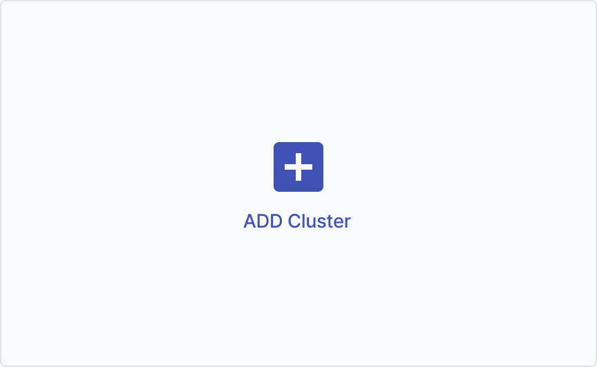

2. 아래 모달 창이 뜨면 추가할 클러스터 정보(이름, IP 주소, Description)를 입력합니다.

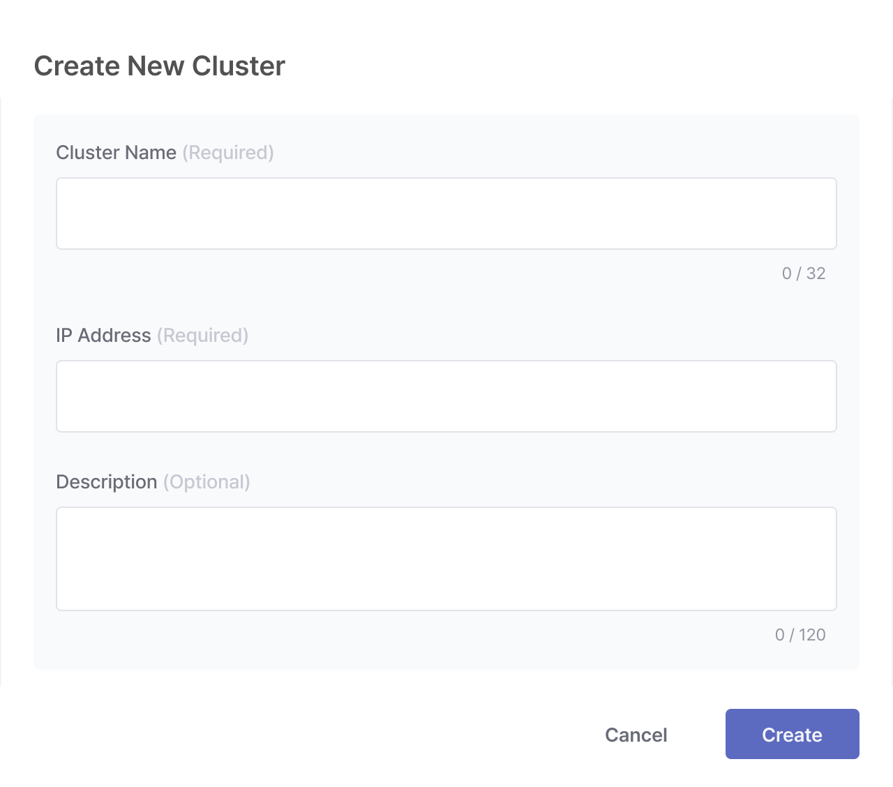

- 이름, IP 주소는 필수 입력 항목입니다.
- 개별 클러스터 삭제 시 확인 모달에서 [삭제] 버튼 클릭

**GPU 노드 모니터링하기**
~~~~~~~~~~~~~~~~~~~~~~~~~~~~~~~~~~~~~~~~~~~~~

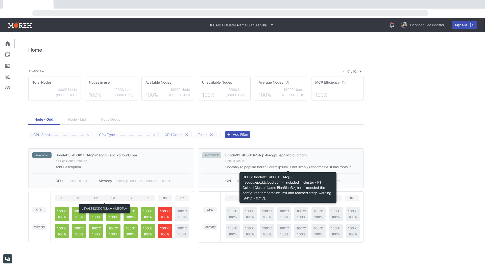

- **Node Monitor**
    - 모니터링 리스트는 Grid(바둑판 뷰)와 List(목록형 뷰)로 제공되며 사용중인 노드와 이름 순서로 정렬됩니다.

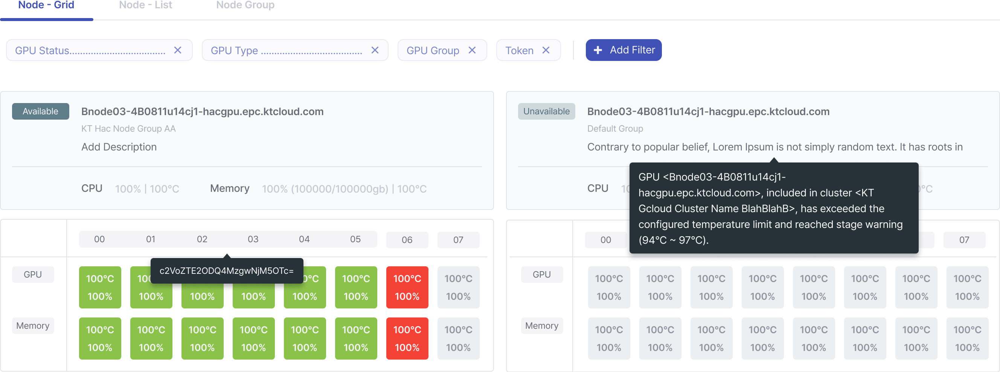

- **Node - Grid** 에서 노드 1개의 정보는 아래와 같이 나타납니다.

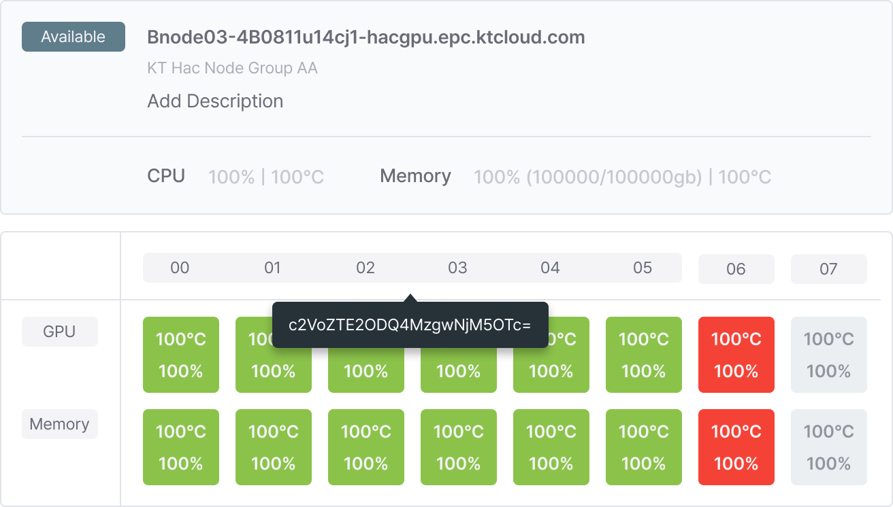

    - 노드 이름 (호스트 이름)
    - 노드가 소속된 GPU 디바이스 그룹
    - Description (Cluster 추가 시 Admin 관리자가 입력한 노드 사용 관련 내용 )
    - CPU 온도와 노드 메모리 사용률 정보
    - GPU 정보
        - 00번 부터 07번까지 각 GPU 디바이스로 구분
        - 최상단 디바이스 번호에 토큰 포함관계가 표현
            - `00~05`로 그룹핑되어있는 부분이 같은 사용자가 사용하는 노드입니다. 그룹핑된 부분에 마우스 오버시 해당 디바이스 묶음을 사용하는 토큰에 대한 정보가 툴팁으로 제공됩니다.
    - GPU 메모리 정보
        - 해당 디바이스 메모리의 현재 온도와 사용률을 나타냄
        - GPU 디바이스의 사용 현황이 색상으로 표현됨
            - 초록 - 사용중 (Processing)
            - 회색 - 대기중 (Idle)
            - 빨간색 - 사용 불가 (Shutdown)

- **Node List** 에서 모니터링 리스트에서 제공하는 노드 정보는 위 Node Grid(바둑판 뷰)의 셀과 동일합니다.

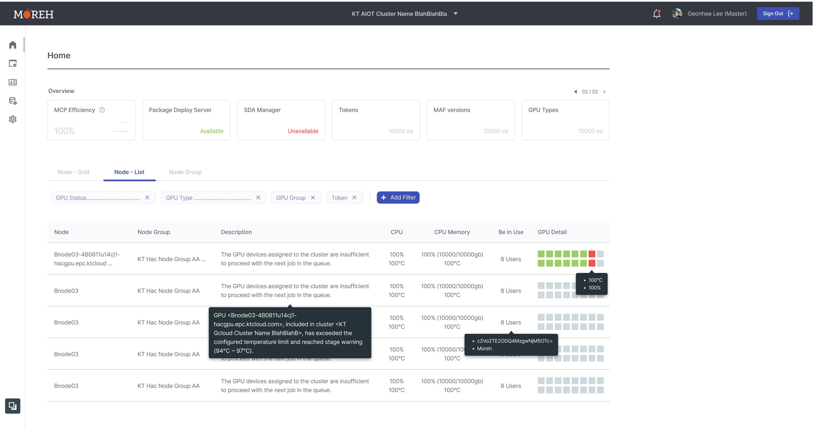

    - 설치된 모레 솔루션에 마우스 오버시 버전 리스트 툴팁으로 제공됩니다.
        - 해당 노드를 사용하는 HAC 사용자 계정 정보

**노드 목록에 필터링 적용하기**

Add Filter를 적용할 경우 선택된 필터링 내용을 해시태그 형태로 제공합니다. 

리스트 우측 상단에 다음 [+ Add Filter] 버튼을 클릭하여 아래 모달에 노드 목록에 표시될 항목을 선택합니다.

.. grid:: 2

    .. image:: ../image/MCP/addFilterModal.png
        :width: 200

    .. grid-item-card:: 
        
        - GPU 현재 상태를 다음 3가지로 구분하여 선택된 상태에 해당하는 노드가 필터링 결과로 제공됩니다.
           
           - 대기중 (Idle)
         
           - 사용중 (Processing)
          
           - 사용 불가 (Shutdown)
        
        - GPU 종류
           
           - 현재 해당 클러스터에 존재하는 사용자가 설정한 GPU 종류에 따라 필터링 가능하며 체크 박스 형태로 여러개 선택 가능합니다.
        
        - 노드 그룹
            
           - 전체 노드 그룹, Group A, Group B, Group C에 해당하는 노드가 필터링 결과로 제공됩니다.
        
        - User
        
           - 전체 사용자 계정이 제공되며 특정 계정을 추가하거나 제외할 수 있습니다.

모니터링 리스트는 바둑판 뷰와 리스트 뷰로 제공되며 사용중인 노드와 이름 순서로 정렬됩니다.
바둑판 뷰의 노드 목록에서 노드 1개의 정보는 아래와 같이 나타납니다.

**사용자 Job 대기열 우선순위 설정하기**
~~~~~~~~~~~~~~~~~~~~~~~~~~~~~~~~~

- 작업 우선순위(Priority)
  - 작업 우선순위는 Job Queue에서 대기중인 Job중에서 할당받는 순서를 결정합니다.
    - 우선순위 값이 **99로 갈수록 우선순위가 높으며 먼저 GPU 노드가 할당** 됩니다.
  - 사용자 별로 기본 우선순위가 있으며 Queue에서 우선순위가 가장 높은 Job이 먼저 GPU 노드를 할당 받을 수 있습니다.

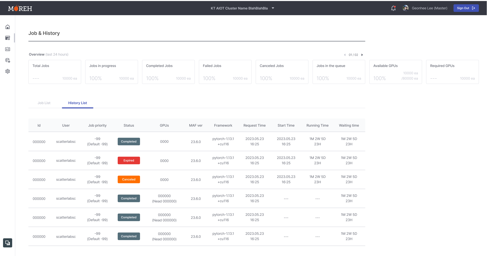

History List에는 가장 최근에 종료된 작업순으로 정렬됩니다.

전체적으로 작업 목록(Job List)와 동일한 값을 제공하며 상태값(Status)만 Completed(완료), Expired(HAC사용자 또는 Admin의 input 없이 모종의 에러로 종료), Canceled(HAC 사용자가 수동으로 종료) 로 제공됩니다.

Job 목록에 사용자가 요청한 작업은 사용자의 우선순위에 해당되는 기본값을 가지고 들어오며, 만약 작업이 대기열에 들어가게 되면 해당 우선순위 값을 첫 번째 정렬 값으로 사용하여 대기열에 적용됩니다. 이렇게 정렬된 대기열(Queue)에 있는 각 작업의 우선순위를 수동으로 변경할 수 있습니다. 

리스트에서 각 작업의 우선순위 변경 아이콘을 클릭하면 모달을 통해 작업 우선순위 변경이 가능합니다.

**End User(HAC 사용자) 관리하기**
~~~~~~~~~~~~~~~~~~~~~~~~~~~~~~~~~

User Manage 페이지에서는 사용자 관리 페이지에서는 해당 클러스터에 포함된 모든 HAC 사용자를 관리할 수 있습니다. 상단에 있는 전체 유저 개요 정보와 하단의 User List(사용자 목록)이 제공됩니다.

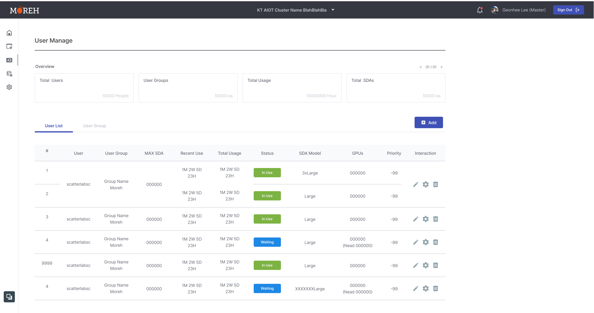

- **Overview (전체 유저 개요 정보)**
    - 전체 유저 수
    - 사용자 그룹 수
    - 총 누적 사용량 (GPU를 사용한 시간)
    - 전체 SDA 수
- **User List (사용중 - 대기중 순서로 정렬)**
    - 생성된 SDA 번호
    - 사용자 이름
    - 사용중인 SDA Model
    - 현재 상태
       - GPU 사용중
       - GPU 사용 안하는 대기중
    - 사용중인 GPU 개수
    - 소속 그룹
      - Admin 사용자가 지정한 사용자 설정 엔드 유저 그룹
    - 우선 순위
      - 해당 사용자가 작업을 진행하면 해당 값을 디폴트로 배정되며 작업 리스트에서 사용자 우선 순위와 별개로 조정 가능 (디폴트 값 = 0)
    - 최근 실행 시간
    - 누적 사용량
    - 상호작용 아이콘
        - 사용자 정보 편집
        - 사용자 삭제
        - 사용자 환경 변수 설정

**HAC 사용자의 SDA 모델 관리 - SDA 그룹 추가하기**
~~~~~~~~~~~~~~~~~~~~~~~~~~~~~~~~~~~~

1. SDA Model Group 페이지로 이동합니다.

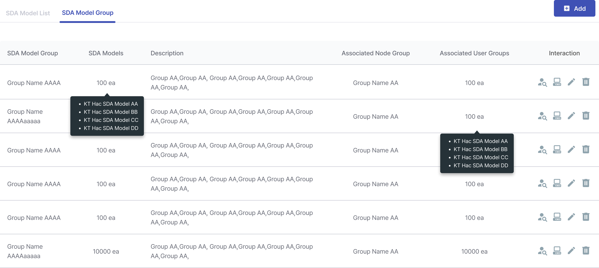

2. 모델 목록 패널 상단 우측에 있는 [+ Add] 버튼을 클릭하여 아래와 같은 모달에서 해당 정보를 입력합니다.

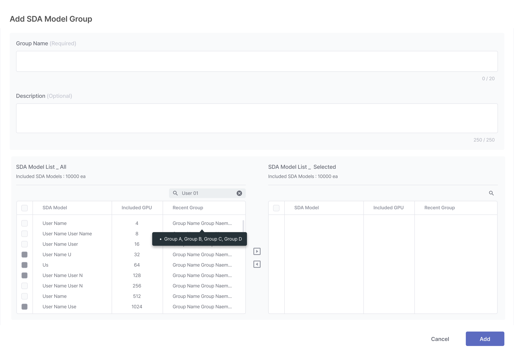

   1. SDA Model 그룹명
   2. 드롭다운에서 SDA Model 선택
   3. 그룹 설명
   4. SDA Model그룹과 1:1로 매칭되는 디바이스 그룹을 선택합니다.

**SDA Model 그룹 사용자 그룹과 매칭하기**
~~~~~~~~~~~~~~~~~~~~~~~~~~~~~~~~~~~~~~~~~~~~~~~~~~~~~~

SDA Model 그룹을 사용자 그룹과 매칭하면 HAC 사용자인 고객의 계정에 따라 사용할 수 있는 AI 가속기 디바이스와 그 수를 제어할 수 있습니다. 예를 들어, A 고객은 Small (노드를 4개 까지만 사용할 수 있는 SDA Model)과 Medium만 사용하도록 설정된 SDA Model 그룹A에 연결됩니다. B 고객은 Medium부터 Large와 xLarge까지 옵션을 선택할 수 있도록 제한을 설정됩니다. 이렇게 그룹 기능을 통해 유연하게 GPU 자원을 조절할 수 있게 됩니다.

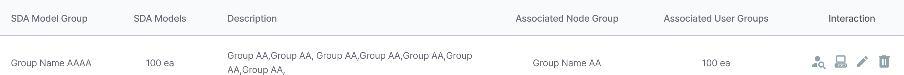

SDA Model Group List의 Interacton에 해당하는 첫번째 아이콘을 클릭해서 해당 SDA Model그룹과 1:1로 매칭되는 사용자 그룹을 선택할 수 있습니다.

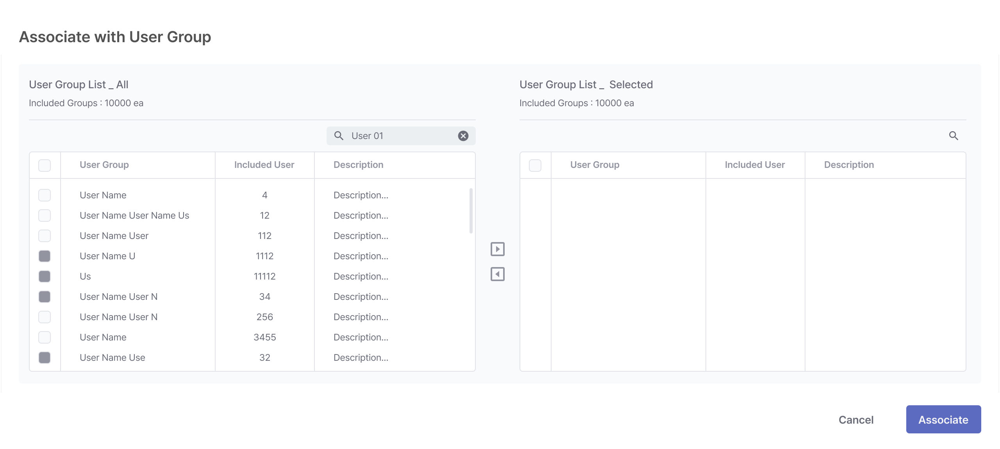

**모레 솔루션 버전 정보 수정하기**
~~~~~~~~~~~~~~~~~~~~~~~~~~~~~~~~~~~~

1. Cluster Setting 페이지로 이동합니다.
2. 모레 솔루션(MAF) 버전을 구성하는 아래 정보를 입력한 후 버전 수정을 클릭합니다.

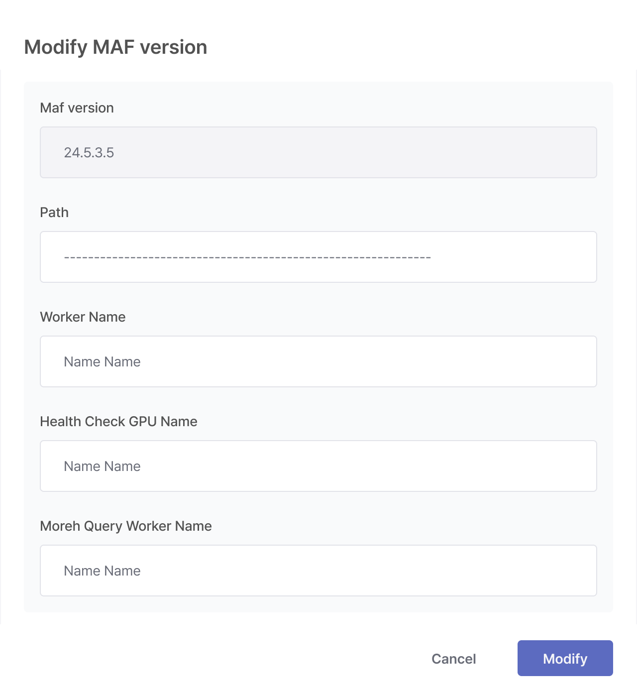
