HAC Web Console KT 관리자용 가이드
==============================

이 문서는 HAC Web Console을 사용하여 GPU 자원 모니터링 및 관련 작업 등을 위한 가이드입니다.
KTC 관리자가 HAC 클러스터의 자원 사용을 최적화하고 발생 가능한 문제를 빠르게 대응하는데 도움을 줍니다. 

- `HAC Web Console Overview <https://docs.moreh.io/ko/latest/MCP/HAC%20Web%20Console%20Manual.html#hac-web-console>`_
- `Web Console Components <https://docs.moreh.io/ko/latest/MCP/HAC%20Web%20Console%20Manual.html#id4>`_
    - `1. Cluster List <https://docs.moreh.io/ko/latest/MCP/HAC%20Web%20Console%20Manual.html#id6>`_
       - `Admin User Manage <https://docs.moreh.io/ko/latest/MCP/HAC%20Web%20Console%20Manual.html#id7>`_
       - `Notification Manage <https://docs.moreh.io/ko/latest/MCP/HAC%20Web%20Console%20Manual.html#id8>`_
    - `2. Home GPU 모니터링 <https://docs.moreh.io/ko/latest/MCP/HAC%20Web%20Console%20Manual.html#home-gpu-monitoring>`_
    - `3. Global 모니터링 <https://docs.moreh.io/ko/latest/MCP/HAC%20Web%20Console%20Manual.html#global>`_
    - `4. Job & History <https://docs.moreh.io/ko/latest/MCP/HAC%20Web%20Console%20Manual.html#id11>`_
    - `5. HAC 사용자 관리하기  <https://docs.moreh.io/ko/latest/MCP/HAC%20Web%20Console%20Manual.html#end-user-hac>`_
    - `6. SDA 모델 관리 <https://docs.moreh.io/ko/latest/MCP/HAC%20Web%20Console%20Manual.html#sda-model>`_
    - `7. 클러스터 설정 <https://docs.moreh.io/ko/latest/MCP/HAC%20Web%20Console%20Manual.html#id20>`_
- `트러블슈팅 <https://docs.moreh.io/ko/latest/MCP/HAC%20Web%20Console%20Manual.html#id11>`_

HAC Web Console Overview (서비스 개요)
----------------------------------------

HAC Web Console은 KT Cloud 관리자를 위한 GPU 관리 도구로, GPU 리소스 상태를 실시간으로 모니터링하여 현재 할당된 AI 가속기의 작업 상태와 클러스터 내부의 문제를 빠르게 감지하고 관리할 수 있는 플랫폼입니다.

HAC Web Console을 사용하면 KTC 관리자는 다음과 같은 기능을 활용할 수 있습니다:

1. **실시간 GPU 상태 모니터링** : 실시간 GPU 상태 모니터링: 서버 상태와 노드별 동작 여부를 확인하고, GPU의 가용성 및 예약 현황을 실시간으로 쉽게 파악할 수 있습니다. 또한, GPU 관련 작업 로그를 통해 성능 이슈나 문제를 신속하게 분석할 수 있습니다.
2. **개발자의 니즈에 따라 GPU 자원 조정 가능** : GPU 자원 분배에 관한 상태 값을 사용자의 편의와 요구에 따라 다양하게 조정할 수 있으며, 원활한 서비스 제공을 위해 필요한 조치를 즉시 취할 수 있습니다.

위 제공된 기능들을 통해 KT Cloud 관리자는 GPU 리소스를 효율적으로 관리하고, 클러스터의 안정성을 바탕으로 사용자들에게 원활한 서비스를 제공할 수 있습니다.

Web Console Components
------------------------------------
HAC GPU 사용을 위한 전용 관리 페이지입니다.

Web Console의 요소들과 각 기능을 어떻게 사용할 수 있는지 설명합니다.

1. **Cluster List** 
   
   - GPU 클러스터의 상태 및 실시간 사용 정보를 지표로 나타냅니다.
  
   - Admin User Manage (관리자 정보 변경 및 권한 설정하기)
  
   - Notification Manage (전체 알림 관리하기)

2. `Home GPU 모니터링 <https://docs.moreh.io/ko/latest/HAC/8_api.html#user>`_
    - 각각의 클러스터에 포함된 GPU 자원의 종합적인 모니터링이 가능하며 HAC 사용자에게 제공되는 GPU를 관리할 수 있습니다.
3. Global 모니터링
    - 어떤 페이지에서든 빠르게 전체 GPU 클러스터에 포함된 GPU Node 들의 상태를 모니터링할 수 있습니다.
4. Job & History
    - 클러스터 내 GPU를 사용하는 작업을 관리하고 작업 진행 상황과 작업에 관련된 로그 및 세부사항을 확인할 수 있습니다. 
5. 사용자 Token 관리 
    - 각 클러스터에 포함된 모든 HAC 사용자 정보(사용자 그룹 수, 누적 사용량, 전체 SDA 개수 등)를 제공합니다.
6. SDA 모델 관리
    - 각 클러스터에서 HAC 사용자에게 제공되는 SDA Model을 관리할 수 있습니다.
7. 클러스터 설정
    - 각 클러스터 당 모레 솔루션의 버전을 관리할 수 있습니다.

1. Cluster List
++++++++++++++++++++++++++++++

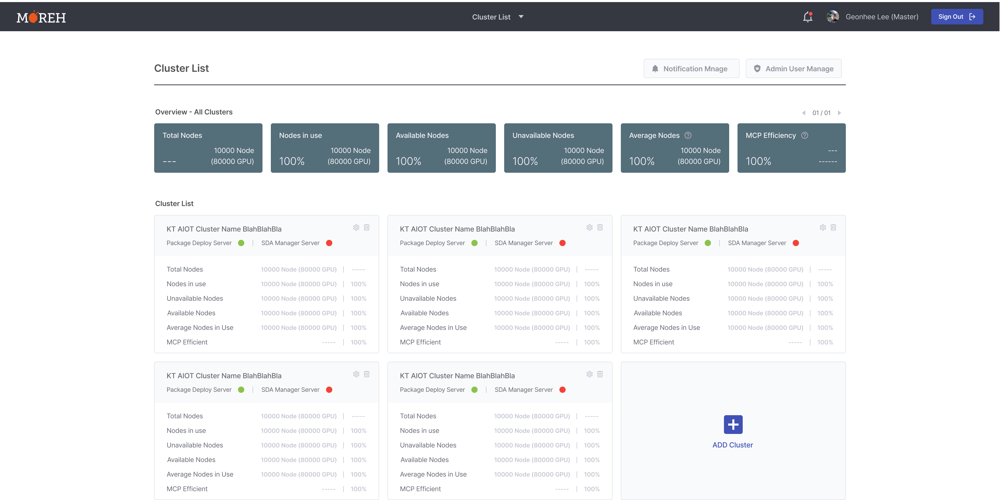

상단에 [Notification Manage] **버튼** 과 [Admin User Manage] **버튼**  클릭한 후 각 알람 관리 페이지와 Admin 사용자 관리 페이지로 이동하여 Admin 사용자 개인정보와 권한 및 웹콘솔의 모든 알림과 Admin 사용자를 관리할 수 있습니다. 

**Cluster List** HAC Web Console의 모든 클러스터에 대한 통합 개요 정보와 특정 클러스터의 세부 정보(패키지 배포 서버 상태, SDA Manager 상태, GPU의 클러스터 사용률 등)를 제공합니다.

**✅ Cluster 추가하기**
~~~~~~~~~~~~~~~~~~~~~
1. 웹 콘솔의 첫 화면에서 아래 클러스터 추가 [+ ADD Cluster] 아이콘을 클릭합니다.
   
.. image:: ../image/MCP/add_cluster.png
  :width: 200
  :alt: Alternative text

2. 아래 모달 창이 뜨면 추가할 클러스터 정보(이름, IP 주소, Description)를 입력합니다.

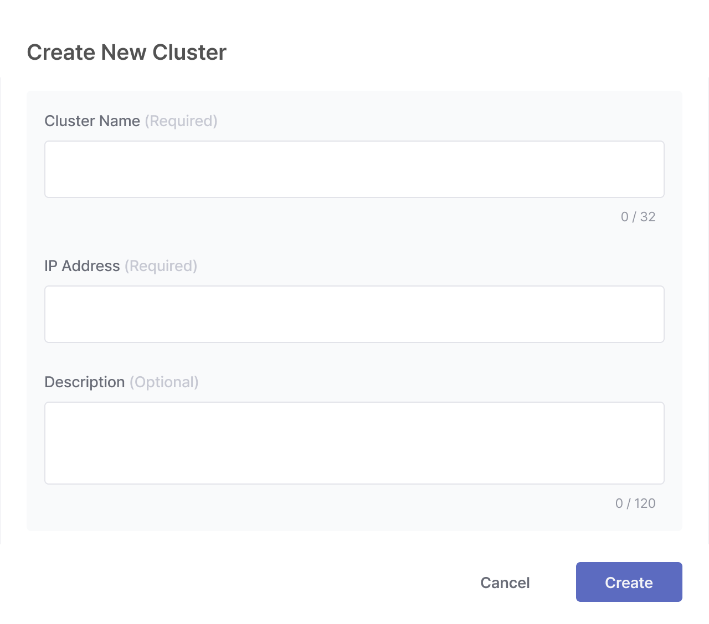

- 이름, IP 주소는 필수 입력 항목입니다.
- 개별 클러스터 삭제 시 확인 모달에서 [삭제] 버튼 클릭

Admin User Manage (관리자 개인 정보 변경 및 권한 설정하기)
~~~~~~~~~~~~~~~~~~~~~~~~~~~~~~~~~~~~~~~~~~~~~~~~~

사용자 관리 페이지에서 왼쪽 사이드바의 [Permission Manage]를 클릭하면 아래와 같이 Admin User List가 나타납니다. Admin User List에는 사용자 프로필 아이콘, 관리자 ID, 관리자 이름, 권한 Type 정보와 Master 권한의 관리자가 상호작용가능한 아이콘이 제공됩니다.

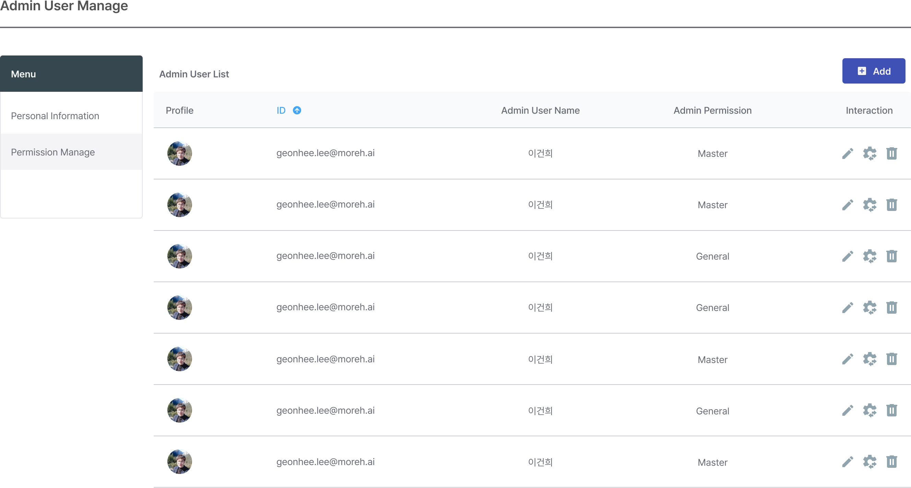

Admin User List에서 특정 관리자의 첫번째 Interaction 아이콘을 클릭하면 관리자에 대한 정보를 수정할 수 있습니다. Master 계정의 사용자는 계정(General, Master 모두)에 대한 정보를 수정 가능 하며, General 계정의 사용자는 개인 계정 정보만 수정 가능합니다.

아래와 같은 모달이 뜨면 다음 정보를 입력합니다.

.. grid:: 2

    .. image:: ../image/MCP/modify_personal.png
        :width: 330

    .. grid-item-card:: 

        1. 프로필 사진 

           권장사이즈: 120px(width) * 120px(height) 또는 1:1 비율

        2. 관리자 ID

           메일 주소이며 한 번 생성된 후에는 변경 불가능합니다.
        3. 비밀번호 (필수 입력 사항)
        4. 영문, 숫자 또는 대문자 포함 제한이 없습니다.
        5. 관리자 이름 (필수 입력 사항)
        6. 관리자 권한

           - Master 권한, General 중 선택합니다.

           - Master 계정 : Moreh에서 직접 만들어서 제공하는 계정이며 General, Master 계정 모두 생성과 수정 가능

           - General 계정 : 개인 계정 정보만 수정 가능

두번째 Interaction 아이콘을 클릭하면 해당 관리자의 권한을 General/Master로 변경할 수 있습니다.  Master 권한의 관리자만 변경 가능합니다.

세번째 휴지통 모양의 Interaction 아이콘을 클릭하면 해당 관리자를 삭제할 수 있습니다. Master 권한의 관리자만 삭제 가능합니다.

**Admin 관리자 계정 추가하기**

.. warning::

    Master 권한의 관리자만 새로운 Admin 계정을 추가할 수 있습니다.

Admin User List 상단의 [+ Add] 버튼을 클릭하면 Modify Personal Info(Admin 개인 정보 수정) 모달과 동일한 모달이 아래와 같이 등장합니다. 모달에 추가할 관리자 정보를 입력합니다.  

.. grid:: 2

    .. image:: ../image/MCP/addUser.png
        :width: 330

    .. grid-item-card:: 

        1. 프로필 사진 

           권장사이즈: 120px(width) * 120px(height) 또는 1:1 비율

        2. 관리자 ID

           메일 주소이며 한 번 생성된 후에는 변경 불가능합니다.
        3. 비밀번호 (필수 입력 사항)
        4. 영문, 숫자 또는 대문자 포함 제한이 없습니다.
        5. 관리자 이름 (필수 입력 사항)
        6. 관리자 권한

           - Master 권한, General 중 선택합니다.

           - Master 계정 : Moreh에서 직접 만들어서 제공하는 계정이며 General, Master 계정 모두 생성과 수정 가능

           - General 계정 : 개인 계정 정보만 수정 가능

Notification Manage (전체 알림 관리하기)
~~~~~~~~~~~~~~~~~~~~~~~~~~~~~~~~~~~~~~~~~~~~~

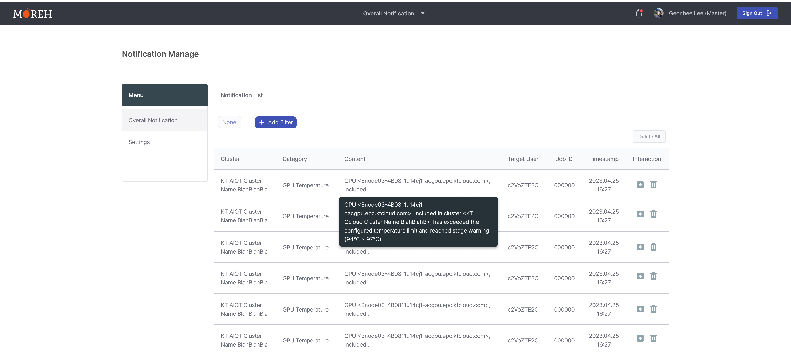

Notification Manage 페이지의 Notification List(클러스터 알람 목록)에 [+ Add Filter] 버튼을 클릭하면 다음 필터 패널이 나타납니다. 알림 특정 태그를 추가/제외 가능합니다.

.. grid:: 2

    .. image:: ../image/MCP/noti_filter.png
        :width: 330

    .. grid-item-card:: 

        - 모니터링할 특정 기간에 대해 년, 월, 일 시간으로 시작 날짜와 종료 날짜를 입력합니다.
        
        - 알림리스트 중 모니터링할 클러스터를 선택 가능합니다.
       
        - 제공되는 알림 분류 중 선택 가능합니다.
            
        1. GPU 에러
          
          - 물리 GPU에 에러가 발생한 경우
        
        2. GPU 부족
          
          - 클러스터에 배정된 GPU 자원이 부족하여 대기열 속 다음 작업을 진행하지 못하는 경우
        
        3. GPU 온도
          
          - GPU 디바이스 온도가 86~93°C인 경우 주의 단계 알림
          
          - GPU 디바이스 온도가 94~97°C인 경우 경고 단계 알림
          
          - GPU 디바이스 온도가 98~°C인 경우 조치 단계 알림
        
        4. 작업 에러
        
         - 진행 중이던 작업이 에러가 발생하여 멈춘 경우

2. Home GPU Monitoring
++++++++++++++++++++++++++++++

.. image:: ../image/MCP/home_gpu.png
  :width: 900
  :alt: Alternative text

- **Overview 클러스터 개요**
    - 해당 클러스터에 포함되어 있는 전체 노드 수
      - Node 개수와 GPU 자원의 양으로 나타냄
    - 현재 클러스터에서 사용 중인 노드 수
      - 사용중인 Node 개수와 GPU 자원의 양을 전체 대비 백분율로 나타냄
    - 현재 클러스터에서 사용 불가능한 노드 수
      - 전체 노드 중 사용 불가능한 노드와 GPU자원의 양을 전체 대비 백분율로 나타냄
    - 평균 사용 중인 노드 수
      - 전일 기준으로 1주일 동안 평균 사용한 노드 수와 GPU 디바이스 수 (전체 대비 백분율)
    - HAC Web Console 효율성 (Service Efficiency)
      - 전체 사용자 계정이 선택한 SDA Model의 GPU 자원의 총합  / 평균 사용중인 GPU 자원의 양 = %
    - 패키지 배포 서버 상태 (원활/불량)
    - SDA Manager 상태 (원활/불량)
    - 해당 클러스터를 사용중인 HAC 사용자 계정 개수
      - 링크 클릭시 HAC 사용자 관리 페이지로 이동합니다.
    - 사용 가능한 노드 개수
    - GPU 디바이스 종류의 개수
      - 현재 해당 클러스터에 등록된 물리적인 GPU 제품 종류의 개수
        - (예시) Group A 클러스터에 등록된  A100, V100, MI250 세 종류가 있을 경우 **GPU 디바이스 종류의 개수: 3개** 로 표현
  
- **Node Monitor**
    - 모니터링 리스트는 Grid(바둑판 뷰)와 List(목록형 뷰)로 제공되며 사용중인 노드와 이름 순서로 정렬됩니다.

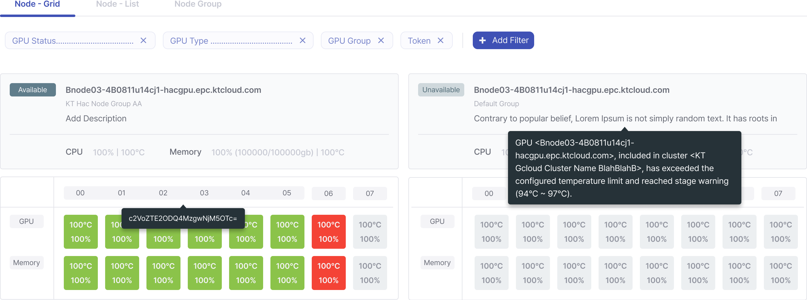

- **Node - Grid** 에서 노드 1개의 정보는 아래와 같이 나타납니다.

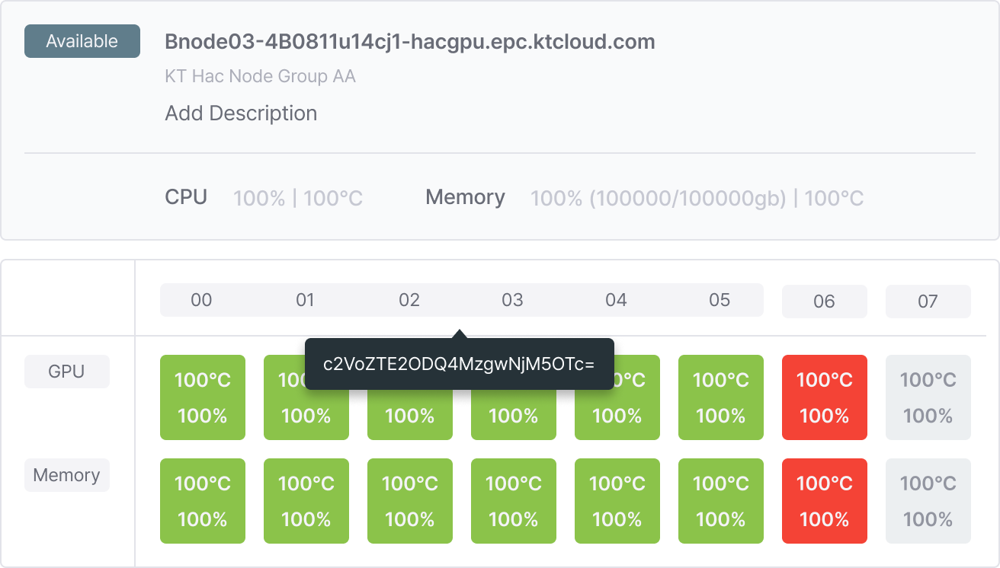

    - 노드 이름 (호스트 이름)
    - 노드가 소속된 GPU 디바이스 그룹
    - Description (Cluster 추가 시 Admin 관리자가 입력한 노드 사용 관련 내용 )
    - CPU 온도와 노드 메모리 사용률 정보
    - GPU 정보
        - 00번 부터 07번까지 각 GPU 디바이스로 구분
        - 최상단 디바이스 번호에 토큰 포함관계가 표현
            - `00~05`로 그룹핑되어있는 부분이 같은 사용자가 사용하는 노드입니다. 그룹핑된 부분에 마우스 오버시 해당 디바이스 묶음을 사용하는 토큰에 대한 정보가 툴팁으로 제공됩니다.
    - GPU 메모리 정보
        - 해당 디바이스 메모리의 현재 온도와 사용률을 나타냄
        - GPU 디바이스의 사용 현황이 색상으로 표현됨
            - 초록 - 사용중 (Processing)
            - 회색 - 대기중 (Idle)
            - 빨간색 - 사용 불가 (Shutdown)

- **Node List** 에서 모니터링 리스트에서 제공하는 노드 정보는 위 Node Grid(바둑판 뷰)의 셀과 동일합니다.

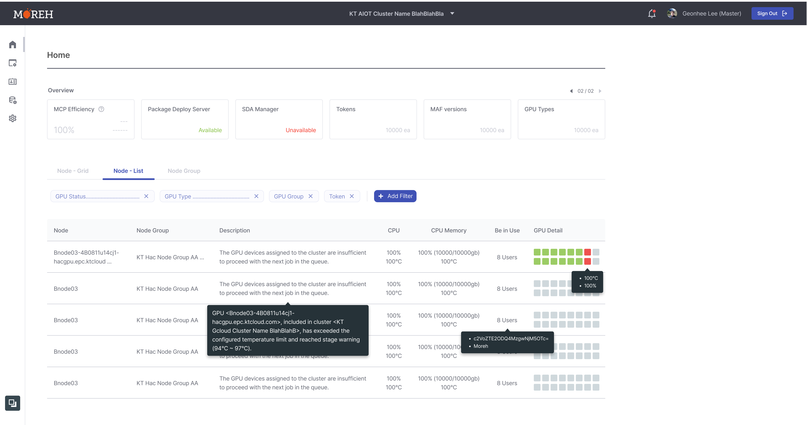

    - 설치된 모레 솔루션에 마우스 오버시 버전 리스트 툴팁으로 제공됩니다.
        - 해당 노드를 사용하는 HAC 사용자 계정 정보

**✅ 노드 목록에 필터링 적용하기**
~~~~~~~~~~~~~~~~~~~~~~~~~~~~~~~~~~~~~~~~~~~~~

Add Filter를 적용할 경우 선택된 필터링 내용을 해시태그 형태로 제공합니다. 

리스트 우측 상단에 다음 [+ Add Filter] 버튼을 클릭하여 아래 모달에 노드 목록에 표시될 항목을 선택합니다.

.. grid:: 2

    .. image:: ../image/MCP/addFilterModal.png
        :width: 200

    .. grid-item-card:: 
        
        - GPU 현재 상태를 다음 3가지로 구분하여 선택된 상태에 해당하는 노드가 필터링 결과로 제공됩니다.
           
           - 대기중 (Idle)
         
           - 사용중 (Processing)
          
           - 사용 불가 (Shutdown)
        
        - GPU 종류
           
           - 현재 해당 클러스터에 존재하는 사용자가 설정한 GPU 종류에 따라 필터링 가능하며 체크 박스 형태로 여러개 선택 가능합니다.
        
        - 노드 그룹
            
           - 전체 노드 그룹, Group A, Group B, Group C에 해당하는 노드가 필터링 결과로 제공됩니다.
        
        - User
        
           - 전체 사용자 계정이 제공되며 특정 계정을 추가하거나 제외할 수 있습니다.

모니터링 리스트는 바둑판 뷰와 리스트 뷰로 제공되며 사용중인 노드와 이름 순서로 정렬됩니다.
바둑판 뷰의 노드 목록에서 노드 1개의 정보는 아래와 같이 나타납니다.

- **Node Group** 

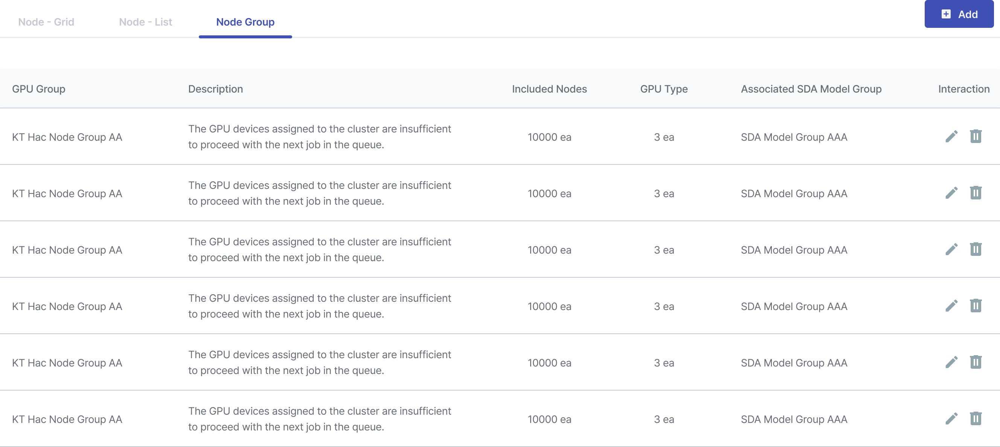

- Node Group은 다음 정보를 제공합니다.
    - Node Group 이름
    - 설명
    - 호함된 노드 수
    - 포함된 디바이스 종류
    - 연관된 SDA 모델 그룹
    - 상호작용
        - 삭제
        - 수정

3. Global 모니터링
++++++++++++++++++++++++++++++

Global Quick Monitoring 페이지는 사용자가 HAC Web Console 내부에서 전체 클러스터를 빠르게 시각적으로 모니터링할 수 있도록 도와주는 패널입니다. 로컬 화면의 좌측 Navigation 바 하단에 위치한 글로벌 모니터링 아이콘을 클릭하면 다음 페이지가 나타납니다. 

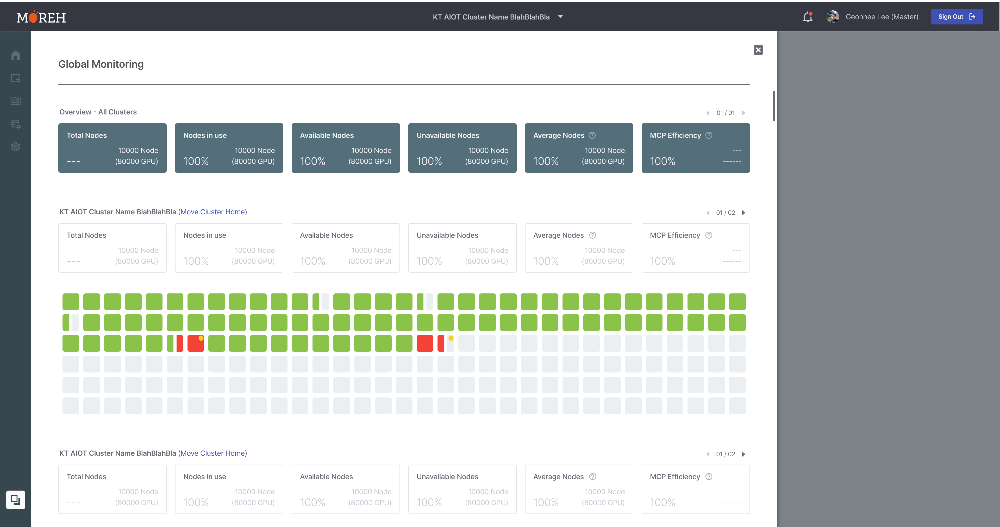

- **Overview - All Clusters (클러스터 개별 개요)**
    - 전체 노드 수
    - 사용중인 노드 수
    - 사용 가능한 노드 수
    - 사용 불가능한 노드 수
    - 평균 사용 노드 수
    - 서비스 효율성
    - 패키지 배포 서버
    - SDA Manager서버
- **클러스터 모니터링**
    - 클러스터의 각 노드에 마우스 오버시 현상태에 따라 아래 정보가 제공됩니다.
        - 초록 Processing - 해당 노드를 사용하는 사용자 계정 정보와 사용시간
        - 빨강 Shutdown -  해당 노드를 사용했던 사용자 계정 정보와 셧다운된 시각
        - 회색 Idle - 해당 노드가 포함된 GPU 그룹 정보

.. grid:: 2

    .. image:: ../image/MCP/1per1node.png
        :width: 400

    하나의 노드를 한명의 HAC 사용자 사용했을때 툴팁

    .. image:: ../image/MCP/multper1node.png
        :width: 400

    하나의 노드를 여러명의 HAC 사용자 사용했을때 툴팁

노드들 중 간혹 두 명 이상의 HAC 사용자가 하나의 노드를 나누어서 사용하는 경우가 있습니다.

이런 경우 노드에 마우스 오버 시 나오는 정보 툴팁도 해당 노드를 사용하는 HAC 사용자가 한명일 때와 여러 명일 때가 구분됩니다. 예를 들어 3개의 노드와 4개의 GPU를 사용하는 경우 해당 HAC 사용자가 사용하는 3개의 노드에 마우스 오버하면 한 명의 유저에 대한 툴팁만 나오겠지만, 4번째 노드인 GPU 4개를 사용하는 노드에 마우스를 오버하면 해당 노드를 나누어서 사용하는 모든 엔드 유저에 대한 정보가 툴팁에 제공됩니다. 또한 툴팁에 제공되는 모든 엔드유저가 사용 중인 노드 시각화 또한 하이라이트 됩니다.

따라서 하나의 노드를 두 명 이상의 HAC 사용자가 사용하는 경우에는 해당 노드에 마우스 오버 시 아래 툴팁 이미지와 같이 사용중인 노드 이름과 현재 상태(Processing/Idle/Shutdown), 사용시간, GPU index 번호, 해당 노드를 나누어서 사용하는 모든 엔드 유저에 대한 정보가 나타납니다.

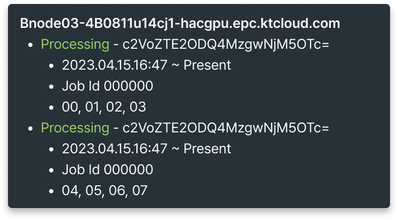

4. Job & History
++++++++++++++++++++++++++++++

개별 클러스터에서 GPU를 사용하여 해당 클러스터에서 진행중인 작업(Job)과 작업 히스토리를 확인하고 GPU 배정이 필요한 작업 간의 우선 순위를 조정하여 먼저 할당 받을 수 있는 페이지입니다. 작업 목록에서 개별 작업 항목을 클릭하면 세부 로그를 확인할 수 있는 페이지로 이동합니다. 또한 클러스터 문제에 대해 즉시 알리는 일련의 경고가 포함됩니다.

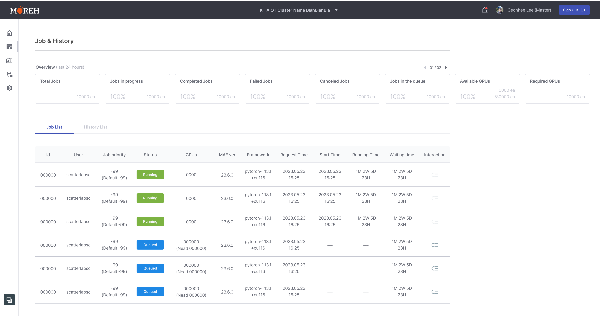

- **Overview (작업 개요)**
  - 현재 사용 가능한 디바이스와 에러가 발생한 작업수 등을 표시됩니다.
- **Job List (작업목록)**
    
   작업 목록에는 다음 정보가 표시됩니다.
    
  - id (아이디)
      - 해당 작업이 가지는 고유 ID 정보
  - User (사용자)
  - Job Priority (작업 우선순위)
      - 작업 우선순위는 Job Queue에서 대기중인 Job중에서 할당받는 순서를 결정합니다.
      - 사용자 계정 별로 기본 우선순위가 있으며 Queue에서 우선순위가 가장 높은 Job이 먼저 GPU 노드를 할당 받을 수 있습니다.
  - Status (현재 상태)
      - Running -> 현재 진행중인 작업으로 GPU 사용중
      - Queued-> 클러스터에 해당 작업에 필요한 GPU가 부족하여 진행중이지 못한 작업
  - GPUs (SDA Model 이 사용중인 GPU 개수)
  - MAF ver (모레 솔루션 버전)
  - Framework (사용 프레임워크 버전)
  - Request Time (작업 요청된 시간)
  - Start Time (시작 시간)
  - Running Time (진행 시간)
      - 시,분, 일 변화 단위로 따라가기 (사용한지 25시간 -> **1D 1H** 로 표기)
  - Waiting Time (대기중인 시간)
  - Interaction (상호작용 아이콘 - 우선순위 변경하기)
  - 개별 Job 항목을 클릭하면 확인할 수 있는 작업 로그

    .. image:: ../image/MCP/joblog.png
      :width: 900

    전체 노드 혹은 노드 별로 확인이 가능합니다.

**✅ 사용자 Job 대기열 우선순위 설정하기**
~~~~~~~~~~~~~~~~~~~~~~~~~~~~~~~~~

    .. image:: ../image/MCP/priorityedit.png
      :width: 30

리스트에서 각 작업의 우선순위 변경 아이콘을 클릭하면 모달을 통해 작업 우선순위 변경이 가능합니다.

- 작업 우선순위(Priority)
  - 작업 우선순위는 Job Queue에서 대기중인 Job중에서 할당받는 순서를 결정합니다.
    - 우선순위 값(-99~99 사이의 정수)이 **99로 갈수록 우선순위가 높으며 먼저 GPU 노드가 할당됩니다.**
  - Job 목록에 사용자가 요청한 작업은 사용자의 우선순위에 해당되는 기본값을 가지고 들어오며, 만약 작업이 대기열에 들어가게 되면 해당 우선순위 값을 첫 번째 정렬 값으로 사용하여 대기열에 적용됩니다. 이렇게 정렬된 대기열(Queue)에 있는 각 작업의 우선순위를 수동으로 변경할 수 있습니다. 

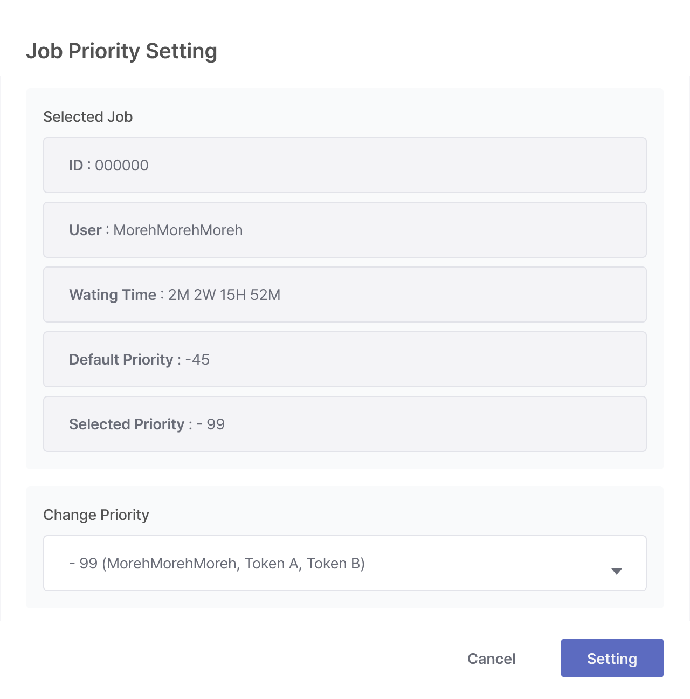

**History List (작업 히스토리)**

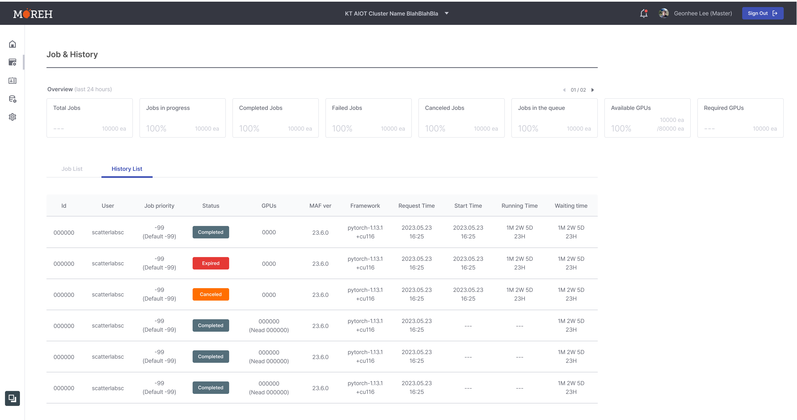

History List에는 가장 최근에 종료된 작업순으로 정렬됩니다.

전체적으로 작업 목록(Job List)와 동일한 값을 제공하며 상태값(Status)만 Completed(완료), Expired(HAC사용자 또는 Admin의 input 없이 모종의 에러로 종료), Canceled(HAC 사용자가 수동으로 종료) 로 제공됩니다.

.. image:: ../image/MCP/changeOrder.png
  :width: 60

리스트에서 각 작업의 우선순위 변경 아이콘을 클릭하면 모달을 통해 작업 우선순위 변경이 가능합니다.

5. End User(HAC 사용자) 관리하기
++++++++++++++++++++++++++++++

User Manage 페이지에서는 사용자 관리 페이지에서는 해당 클러스터에 포함된 모든 HAC 사용자를 관리할 수 있습니다. 상단에 있는 전체 유저 개요 정보와 하단의 User List(사용자 목록)이 제공됩니다.

.. image:: ../image/MCP/userManage.png
  :width: 900

- **Overview (전체 유저 개요 정보)**
    - 전체 유저 수
    - 사용자 그룹 수
    - 총 누적 사용량 (GPU를 사용한 시간)
    - 전체 SDA 수
- **User List (사용중 - 대기중 순서로 정렬)**
    - - 사용자 이름 (User)
    - 소속 그룹 (User Group)
    - 사용중인 SDA Model
       - Admin 사용자가 지정한 HAC 사용자 그룹
    - MAX SDA
       - HAC 사용자에게 허용되는 SDA 개수
          - 값이 1인 경우 허용된 Multi Use 값이 제공됩니다.
          - 값이 1이 아닌경우 해당 MAX SDA 값만 제공됩니다.
    - 우선 순위 (Priority)
       - 작업 우선순위는 기본 값(0)과 작업 목록에서 조정 가능한 값으로 구분됩니다.
       - 사용자가 작업을 시작하면 해당 작업에 우선순위가 부여되며, 이 우선순위는 작업 목록에서 사용자 우선순위와 별개로 조정할 수 있습니다. (기본 값 = 0)
    - 최근 실행 시간 (Recent Use) 
    - 누적 사용량 (Total Usage)
    - HAC 사용자 SDA 번호
      - HAC 사용자에게 제공되는 SDA의 고유 ID
    - 사용중인 SDA Model
    - 현재 상태
        - GPU 사용중
        - GPU 사용 안하는중
        - GPU 작업 대기중
    - 상호작용 아이콘 
        - 사용자 정보 편집
        - 사용자 삭제
        - SDA 추가하기

**HAC 사용자 추가하기**
~~~~~~~~~~~~~~~~~~~~~~~~~

User List에 새로운 HAC 사용자를 추가하려면 우측 상단에 [+ Add User]버튼을 클릭 후 아래 모달에서 다음 정보를 입력합니다.

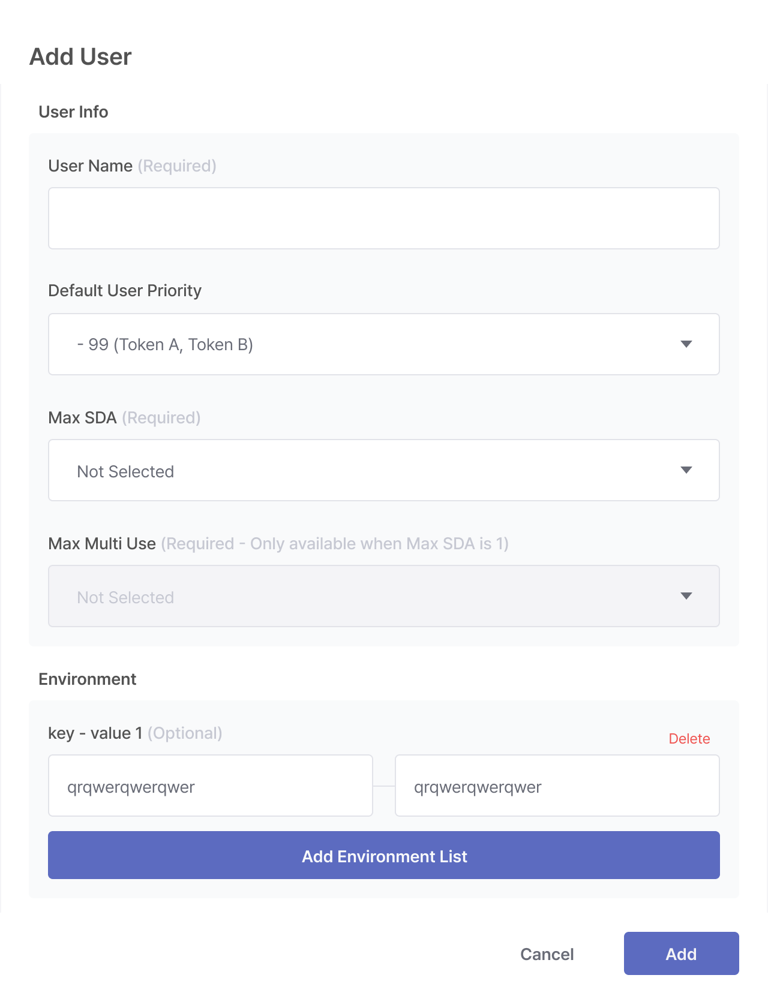

- 사용자 이름 (필수 입력 사항)
- 사용자 우선순위
    - -99~99사이의 숫자 (default=0)
        - 99로 갈수록 우선순위가 높으며 먼저 GPU 노드가 할당됩니다.
- Max SDA 수 (필수 입력사항)
    - (default = not selected)
    - ``Max SDA = 1`` 인 경우 Max Multi Use 활성화
    - ``Max SDA > 1`` 인 경우 Max Multi Use 비활성화
- Max Multi Use: 1개의 SDA로 n번 GPU를 할당할 때 n의 최대값
    - ``Max SDA = 1`` 인 경우에만 사용 가능합니다.
- 사용자 환경변수 설정
    - Key-Value 쌍으로 입력합니다.

**HAC 사용자 정보 삭제하기**
~~~~~~~~~~~~~~~~~~~~~~~~~

휴지통 모양 아이콘을 클릭해서 사용자 정보를 삭제할 수 있으며 삭제 후에는 기본 정보를 불러올 수 없습니다.

**HAC 사용자 계정 정보 변경하기**
~~~~~~~~~~~~~~~~~~~~~~~~~~~~

User List 에서 특정 HAC 사용자에 해당하는 첫번째 Interaction 아이콘을 클릭하면 사용자 정보를 수정할 수 있습니다. 아래와 같은 모달이 뜨면 다음 정보를 입력합니다.

사용자 정보 변경시 아래 정보를 입력합니다.

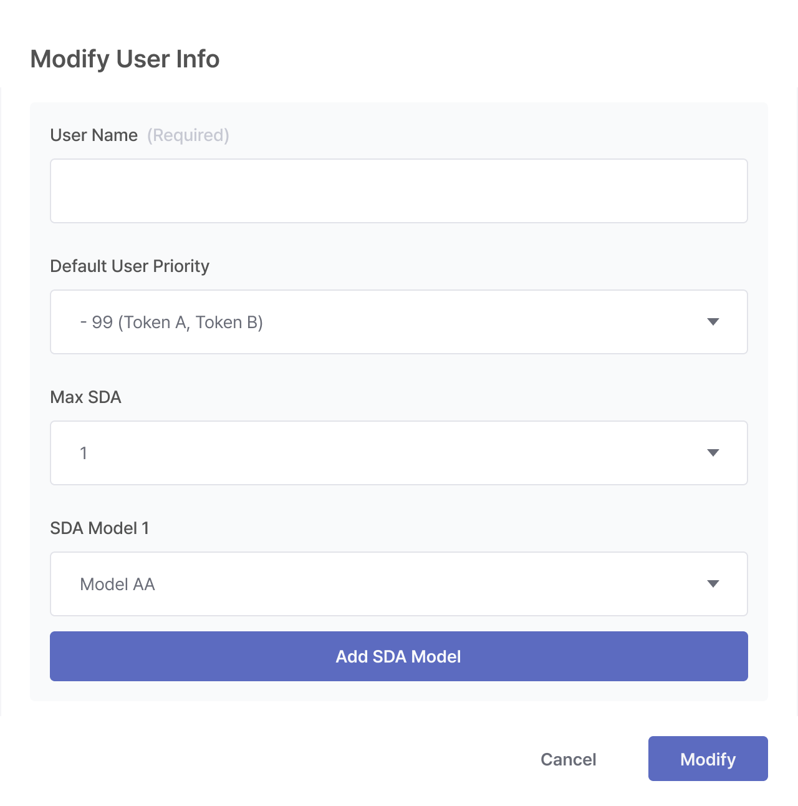

- User Name
- MAX SDA 수
  - default value = 1
  - 하단의 SDA Model 선택은 한 개만 가능하고 추가 버튼 비활성화
- SDA Model * N
  - 하단의 드롭다운 버튼을 클릭해서 max SDA에서 설정한 N개의 SDA Model 추가 가능
- 사용자 우선순위
  - -99~99 사이의 숫자로 설정
  - default value = 0

**✅ 사용자 환경변수 설정하기**
~~~~~~~~~~~~~~~~~~~~~~~~~~~~~~~~~~~~

User List 에서 특정 HAC 사용자에 해당하는 첫번째 Interaction 아이콘을 클릭하면 사용자 환경변수를 설정할 수 있습니다. 아래와 같은 모달이 뜨면 Key 와 Value 값을 입력합니다.

여러 Key-Value 쌍을 추가할 수 있으며 한 번 입력한 환경변수를 삭제할 수 있습니다.

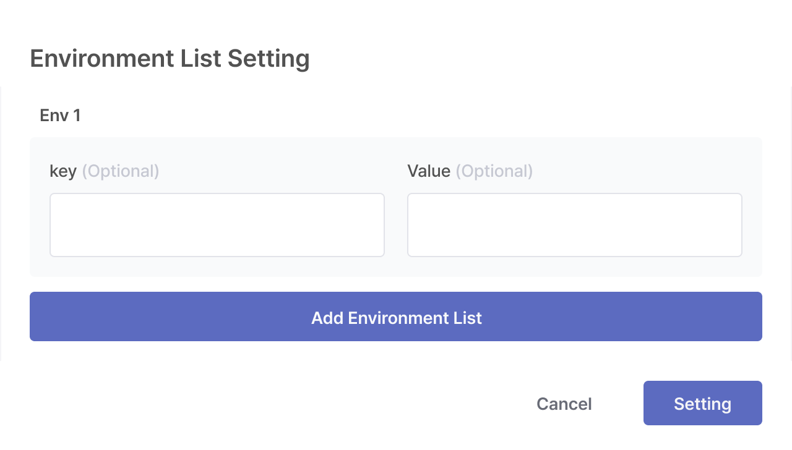

✅ 사용자 그룹 설정하기
~~~~~~~~~~~~~~~~~~~~~~~~~~~~~~~~~~~~

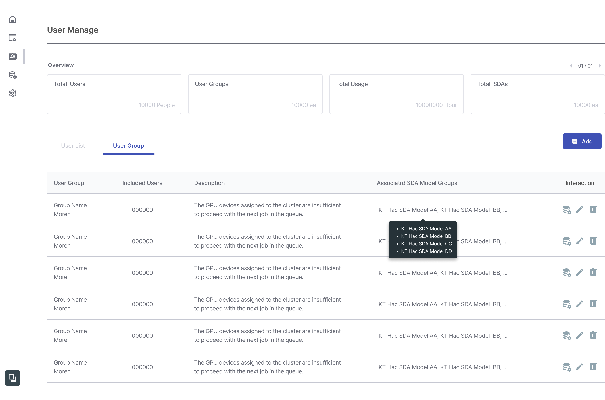

사용자 그룹 목록은 다음과 같은 정보로 구성됩니다.

- **User Group List**
    - HAC 사용자 그룹 이름
    - 해당 그룹에 포함된 사용자 수
    - 설명
    - 연관된 SDA Model Group
        - 해당 HAC 사용자 그룹과 매칭된 SDA Model Group
    - 상호작용 아이콘
        - 그룹 삭제
        - 그룹 수정
        - SDA Model 설정

6. SDA Model 관리하기
++++++++++++++++++++++++++++++

SDA Model 관리 패널에서는 해당 클러스터에서 사용자에게 제공되는 SDA Model 및 SDA Model 그룹을 추가, 변경, 삭제할 수 있습니다.

- **SDA(Software-Defined Accelerator) Model**:  엔드유저가 사용하는 GPU의 단위이며 하나의 사용자 계정에 종속됩니다.
- **SDA Model Group**: 그룹 기능은 고객의 토큰에 따라 사용할 수 있는 AI 가속기 디바이스와 그 수를 편리하게 제어하는 기능입니다. 예를 들어, A 고객은 Small과 Medium만 사용하도록 설정된 SDAModelGroupA에 연결됩니다. B 고객은 Medium부터 Large와 xLarge까지 옵션을 선택할 수 있도록 제한을 설정됩니다. 이렇게 그룹 기능을 통해 유연하게 GPU 자원을 조절할 수 있게 됩니다.

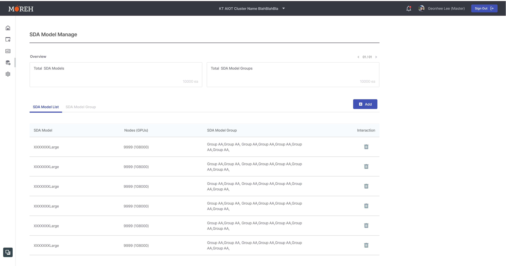

- **SDA Model List**
    - SDA Model 명
    - 구성 노드 수 (+gpu수)
    - 소속 SDA Model 그룹
    - Interaction 아이콘 (SDA Model 삭제)

**SDA Model 삭제하기**
~~~~~~~~~~~~~~~~~~~~~~~~~~~~~~~~~~~~

삭제할 SDA Model의 좌측 휴지통 모양 아이콘을 클릭해서 해당 SDA Model을 삭제할 수 있습니다. 삭제 후에는 이전 정보를 검색할 수 없으며 영향을 받는 작업이 있을 수 있습니다.

우측 상단에 [+ Add]버튼 클릭 후 아래 모달에서 다음 정보를 입력합니다.

.. grid:: 2

    .. image:: ../image/MCP/addSdaModel.png
        :width: 300

    .. grid-item-card:: 

        - SDA Model 명 입력
         
        - 노드 수 선택
         
        - SDA Model 그룹 선택

- **SDA Model Group**
  
.. image:: ../image/MCP/sdaModelGroup.png
  :width: 900

- 포함 모델 수
    - 마우스 오버시 툴팁으로 포함 모델 리스트를 제공합니다.
    - Interaction 버튼 클릭시 다음과 같은 일을 수행할 수 있습니다.
      - 사용자 그룹 매칭
      - 노드 그룹 매칭
      - 특정 SDA 그룹 수정
      - 특정 SDA 그룹 삭제

**SDA 그룹 추가하기**
~~~~~~~~~~~~~~~~~~~~~~~~~~~~~~~~~~~~

1. SDA Model Group 페이지로 이동합니다.

.. image:: ../image/MCP/sdaModelGroup.png
  :width: 900

2. 모델 목록 패널 상단 우측에 있는 [+ Add] 버튼을 클릭하여 아래와 같은 모달에서 해당 정보를 입력합니다.

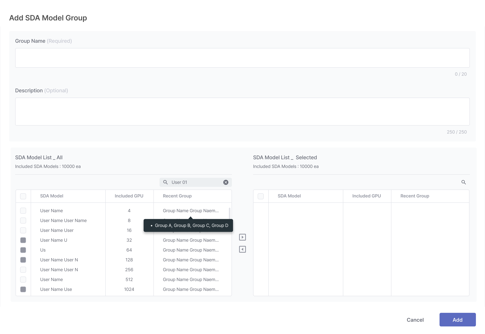

   1. SDA Model 그룹명
   2. 드롭다운에서 SDA Model 선택
   3. 그룹 설명
   4. SDA Model그룹과 1:1로 매칭되는 디바이스 그룹을 선택합니다.

**✅ SDA Model 그룹 사용자 그룹과 매칭하기**
~~~~~~~~~~~~~~~~~~~~~~~~~~~~~~~~~~~~~~~~~~~~~~~~~~~~~~

SDA Model 그룹을 사용자 그룹과 매칭하면 HAC 사용자인 고객의 계정에 따라 사용할 수 있는 AI 가속기 디바이스와 그 수를 제어할 수 있습니다. 예를 들어, A 고객은 Small (노드를 4개 까지만 사용할 수 있는 SDA Model)과 Medium만 사용하도록 설정된 SDA Model 그룹A에 연결됩니다. B 고객은 Medium부터 Large와 xLarge까지 옵션을 선택할 수 있도록 제한을 설정됩니다. 이렇게 그룹 기능을 통해 유연하게 GPU 자원을 조절할 수 있게 됩니다.

.. image:: ../image/MCP/match.png
  :width: 800

SDA Model Group List의 Interacton에 해당하는 첫번째 아이콘을 클릭해서 해당 SDA Model그룹과 1:1로 매칭되는 사용자 그룹을 선택할 수 있습니다.

.. image:: ../image/MCP/matchUserModal.png
  :width: 700

**✅ SDA Model 그룹 Node 그룹과 매칭하기**
~~~~~~~~~~~~~~~~~~~~~~~~~~~~~~~~~~~~~~~~~~~~~~~~~~~~~~

SDA Model 그룹을 Node 그룹과 매칭하면 사용할 수 있는 GPU 노드 수를 쉽고 유연하게 관리할 수 있습니다.

.. image:: ../image/MCP/match.png
  :width: 800

SDA Model Group List의 Interacton에 해당하는 두번째 아이콘을 클릭해서 해당 SDA Model그룹과 1:1로 매칭되는 노드 그룹을 선택할 수 있습니다.

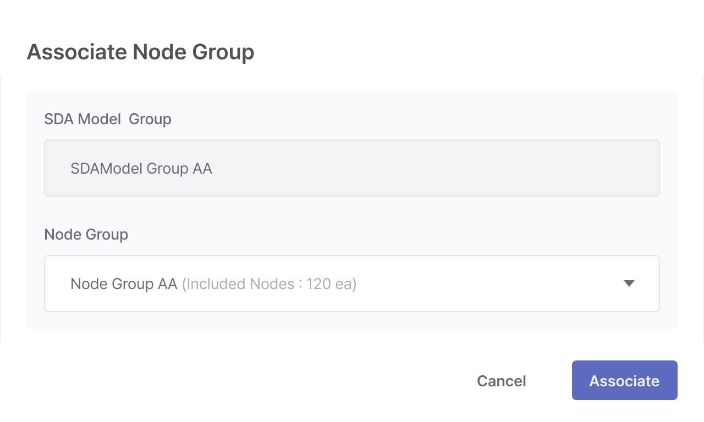

아래 모달에서 SDA Model그룹과 1:1로 매칭되는 GPU 자원을 배분하는 디바이스 그룹을 선택합니다.

.. image:: ../image/MCP/matchNodeGroup.png
  :width: 300

**SDA Model 그룹 변경하기**
~~~~~~~~~~~~~~~~~~~~~~~~~~~~~~~~~~~~

.. image:: ../image/MCP/match.png
  :width: 800

SDA Model Group List의 Interacton에 해당하는 세번째 아이콘을 클릭해서 SDA Model 정보에 해당하는 Node Group 이름, SDA Model, Group Description 등을 수정할 수 있습니다.

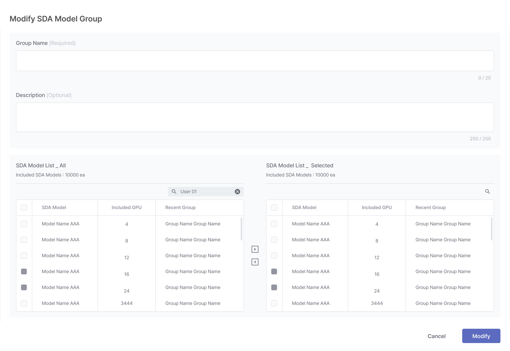

7. 클러스터 설정하기
++++++++++++++++++++++++++++++

Cluster Setting 페이지에서는 현재 클러스터에서 제공되는 모레 솔루션 버전 리스트를 제공하여 모레솔루션 버전을 관리할 수 있습니다.

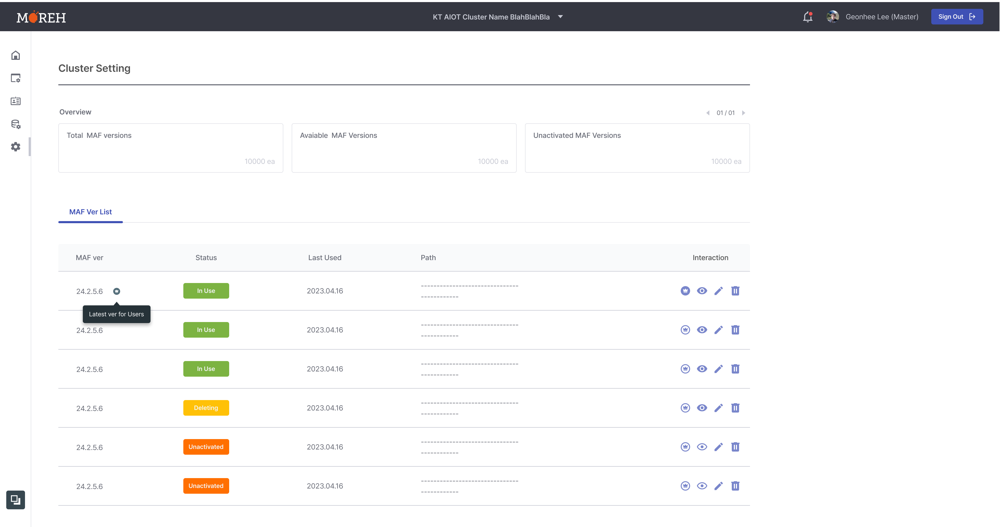

- **Overview (Cluster 개요)**
  - 전체 MAF 버전 개수
  - 사용 가능한 MAF 버전 개수
  - 비활성화된 MAF 버전 개수
- **MAF Ver List**
  - MAF Version (최신 버전인 경우 옆에 아이콘이 표기됩니다)
  - 마프 버전의 현재 상태
    - 사용중 (green)
    - 삭제 대기중 (yellow)
    - 비활성화
      - 활성화 버튼 클릭시 다시 활성화 가능
  - 마지막으로 이 버전이 사용된 시점 (년,월,일)
  - Path
  - 상호작용 (특정 버전 관리하기)
    - 수정
    - 삭제
    - 활성/비활성화
    - 최신 버전 설정하기

**✅ 최신 버전 설정하기**
~~~~~~~~~~~~~~~~~~~~~~~~~~~~~~~~~~~~

MAF Ver List 에서 두번째 Interaction 아이콘을 클릭하면 HAC 사용자가 사용할 수 있는 최신버전으로 설정할 수 있습니다.

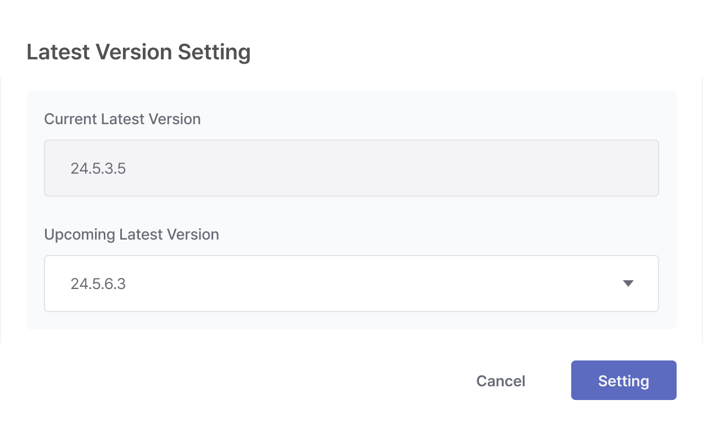

해당버전보다 윗 버전은 자동으로 비활성화됩니다.

**모레 솔루션 버전 정보 수정하기**
~~~~~~~~~~~~~~~~~~~~~~~~~~~~~~~~~~~~

1. Cluster Setting 페이지로 이동합니다.
2. 모레 솔루션(MAF) 버전을 구성하는 아래 정보를 입력한 후 버전 수정을 클릭합니다.

.. image:: ../image/MCP/modifyVersion.png
  :width: 400

트러블슈팅
---------------------------

Q. **웹콘솔에서 GPU 부족 or GPU 온도알람이 뜨는데 정확한 원인을 파악하고 해결할 수 있는 방법은 무엇인가요?**

A. GPU 부족 문제는 다른 작업이나 사용자가 GPU 자원을 과도하게 사용하고 있어서 여유 자원이 부족하거나 메모리 누수 및 냉각 시스템(환기 부족), GPU 드라이버나 관련 설정 문제등 복합적인 요소가 GPU 부족 및 GPU 온도 알림의 원인일 수 있습니다. 

아래 알람 중 GPU 부족 알람이 뜨는 경우 해당 Job과 관련된 에러의 세부 로그를 확인하면 종종 문제의 근본 원인을 찾는 데 도움이 됩니다. Job & History 페이지에서 개별 작업 항목을 클릭하면 세부 로그 파일을 분석하여 문제 발생 시간, GPU 자원 사용에 관한 작업 및 오류 메시지를 확인할 수 있습니다.

1. GPU 에러
  - 물리 GPU에 에러가 발생한 경우
2. GPU 부족
  - 클러스터에 배정된 GPU 자원이 부족하여 대기열 속 다음 작업을 진행하지 못하는 경우
3. GPU 온도
  - GPU 디바이스 온도가 86~93°C인 경우 주의 단계 알림
  - GPU 디바이스 온도가 94~97°C인 경우 경고 단계 알림
  - GPU 디바이스 온도가 98~°C인 경우 조치 단계 알림

HAC 서버상의 자세한 원인을 해결하고 파악하기 위해서는 고객지원을 요청 주시기 바랍니다.

**Q. 사용자 계정 별로 최대 GPU 자원의 양(SDA 개수)을 제한하려면 어떻게 해야 하나요?**

User Management 페이지에서 Max SDA 수를 제한하고자 하는 해당 Token을 클릭한 후 사용가능한 최대 SDA 개수를 입력합니다.