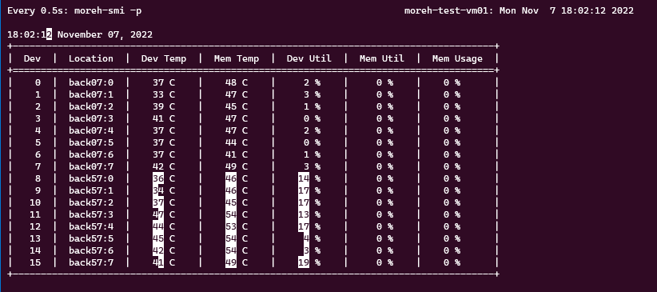

# Moreh 솔루션 사용현황 확인하기

대부분의 사용자들에게 GPU 메모리 및 활용률을 확인하는 것은 CPU 정보를 확인하는 것 보다 복잡한 일입니다. 시스템 관리 인터페이스(SMI) 툴이 없다면 GPU의 유형과 기능을 결정하는 것조차 어려울 수 있습니다. 다행히도 Moreh의 최신 소프트웨어 툴은 이런 디스플레이 측면에서 많은 개선을 이루었습니다.

## **moreh-smi**

현재 선택된 Software-Defined Accelerator(SDA) Model, 실행 중인 학습 프로세스 및 GPU Resource를 얼마나 할당받고 있는지를 확인할 수 있는 명령어입니다.

```bash
(pytorch) ubuntu@moreh-server:~$ moreh-smi

+-------------------------------------------------------------------------------------------+
|                                          Current Version: 23.3.0  Latest Version: 23.3.0  |
+-------------------------------------------------------------------------------------------+
|  Device  |    Name     |      Model     |  Memory Usage  |  Total Memory  |  Utilization  |
+===========================================================================================+
|    0     |  KT AI Accelerator  |  Small.64GB    |  -             |  -             |  -            |
|  * 1     |  KT AI Accelerator  |  Medium.128GB  |  -             |  -             |  -            |
|    2     |  KT AI Accelerator  |  Large.256GB   |  -             |  -             |  -            |
+-------------------------------------------------------------------------------------------+

Processes:
+----------------------------------------------------------+
|  Device  |  Job ID  |  PID  |  Process  |  Memory Usage  |
+==========================================================+
+----------------------------------------------------------+
```

PyTorch 프로그램이 AI 가속기를 사용 중인 동안에는 다음과 같이 실행 중인 프로세스 정보, 전체 메모리 용량과 현재 메모리 사용량이 함께 표시됩니다.

```bash
(pytorch) ubuntu@moreh-server:~$ moreh-smi

+-------------------------------------------------------------------------------------------------+
|                                               Current Version: 22.10.2  Latest Version: 22.10.2  |
+-------------------------------------------------------------------------------------------------+
|  Device  |        Name         |     Model    |  Memory Usage  |  Total Memory  |  Utilization  |
+=================================================================================================+
|    1198  |  KT AI Accelerator  |  Small.64GB  |  46030 MiB     |  65520 MiB     |  -            |
+-------------------------------------------------------------------------------------------------+

Processes:
+--------------------------------------------------------------------+
|  Device  |  Job ID  |   PID   |      Process      |  Memory Usage  |
+====================================================================+
|    1198  |   37696  |  15850  |  python train.py  |  46030 MiB     |
+--------------------------------------------------------------------+
```

## **moreh-smi -p**
``moreh-smi -p`` 명령어를 통해 현재 디바이스별 상세 사용현황을 확인할 수 있습니다.
* 22.11.0 부터 사용 가능합니다.
* 현재 프로세스가 동작중일 때만 확인 가능합니다.
* SDA 하나의 전체 사용량이 아닌 구체적인 GPU의 상태도 확인 가능합니다.
```bash
moreh-smi -p 
```



**Supported Arguments**

**-h 또는 --help**

사용할 수 있는 Supported Arguments을 나열합니다.

```bash
(pytorch) ubuntu@moreh-server:~$ moreh-smi -h
Usage: moreh-smi [-h | --help] [-r | --reset] [-v | --version] [-t | --token]
```

**-r 또는 --reset**

현재 GPU를 사용하여 동작 중인 job을 중지하고 정리합니다.

```bash
(pytorch) ubuntu@moreh-server:~$ moreh-smi -r
Device release success.
```

**-v 또는 --version**

현재 사용 중인 moreh-smi의 version을 확인합니다.

```bash
(pytorch) ubuntu@moreh-server:~$ moreh-smi -v
Moreh AI Platform 22.10.2
```

**-t 또는 --token**

현재 vm에 할당된 token을 확인합니다. Token 고유의 인증 수단이므로 외부로 유출하지 않도록 합니다.

```bash
(pytorch) ubuntu@moreh-server:~$ moreh-smi -t
+----------------------------------------------------------------------------+
|  Moreh-SMI 22.10.2                                                         |
+----------------------------------------------------------------------------+
|  Device  |        Name         |            Token           |     Model    |
+============================================================================+
|    1198  |  KT AI Accelerator  |  ZXhhbXBsZSB0b2tlbiBzdHI=  |  Small.64GB  |
+----------------------------------------------------------------------------+
```